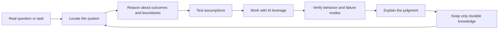
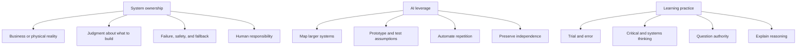
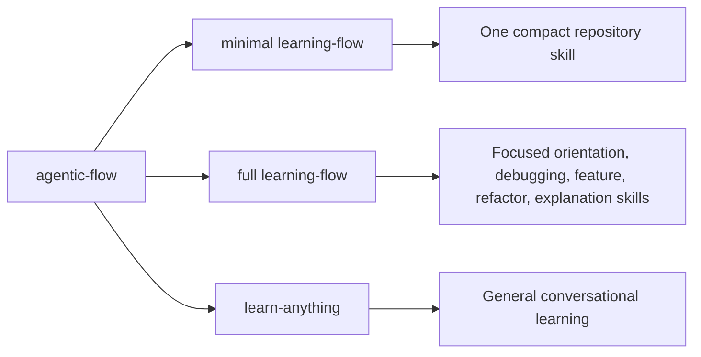

# Codebase Learning Flow

> A small repository harness for learning real systems, using AI aggressively, and keeping human judgment in charge.

Codebase Learning Flow configures a host coding agent. It does not provide its own runtime, sandbox, retry engine, or background worker. The repository supplies durable instructions, focused learning skills, and private local continuity.

> [!IMPORTANT]
> The target is not faster code generation by itself. The target is stronger ownership: understanding the business or physical system, choosing what should be built, validating generated work, managing failure, and retaining the ability to operate without the model.



## Start in two minutes

Run one installer from the repository that should receive the framework:

```powershell
& ([scriptblock]::Create((irm https://raw.githubusercontent.com/legrab/codebase-learning-flow/main/scripts/install.ps1)))
```

```sh
curl -fsSL https://raw.githubusercontent.com/legrab/codebase-learning-flow/main/scripts/install.sh | sh
```

Then give the agent the real task:

```text
Start with my current task. Quietly verify the installed workflow, surface only meaningful
instruction conflicts, and teach the relevant system, domain, and code path while working.
```

New installations use the compact `minimal` profile.

<details>
<summary>Windows Command Prompt and local installer commands</summary>

```bat
powershell -NoProfile -ExecutionPolicy Bypass -Command "iwr https://raw.githubusercontent.com/legrab/codebase-learning-flow/main/scripts/install.bat -OutFile '%TEMP%\install-learning-flow.bat'" && "%TEMP%\install-learning-flow.bat"
```

```powershell
./scripts/install.ps1 -Profile Minimal
./scripts/install.ps1 -Profile Full
./scripts/install.ps1 -Mode Update
```

```sh
./scripts/install.sh --profile minimal
./scripts/install.sh --profile full
./scripts/install.sh --mode update
```

Remote piping executes the referenced revision. Pin a release tag or commit for a team installation.

</details>

## Choose the route

| You want to... | Route | What stays primary |
|---|---|---|
| understand or change the current repository | repository learning | the real engineering task |
| learn a general topic | `learn-anything` | the learner's question |
| configure or review the harness | `agentic-workflow` | repository collaboration policy |

For a general topic:

```text
Use learn-anything to help me understand <topic>. Keep it conversational, build a compact
system model, use one useful example or experiment, and let my questions steer the depth.
```

The general route does not inspect repository code. It can cover science, history, languages, arts, mathematics, teaching, or general technical ideas.

## What the framework optimizes for

| Human ownership | AI leverage | Resilient delivery |
|---|---|---|
| understand the larger system | map unfamiliar territory quickly | identify failure modes and safe boundaries |
| decide what should be built | prototype and compare options | validate generated solutions |
| question assumptions and authority | automate repetitive investigation | retain manual or operational fallback |
| articulate reasoning and tradeoffs | improve teaching material | control access and deployment |
| accept professional responsibility | build domain knowledge faster | integrate legacy and physical systems |

> [!TIP]
> AI should remove avoidable effort, not remove the learner from the causal chain. A useful session ends with a better model, stronger evidence, or clearer judgment, not merely more generated text.

## The learning compass

The shared educational constitution is installed as `agentic-flow/EDUCATION.md`. Each learning route selects only the lenses that improve the current task.



### Priority ownership domains

The framework is repository-agnostic, but it asks deeper questions when work touches:

- laboratory software;
- industrial control and physical equipment;
- regulated or safety-relevant software;
- security and access control;
- architecture and integration;
- verification and validation;
- education and assessment;
- human-machine workflow design.

These are lenses, not assumptions. A web utility does not need a pretend safety case. A laboratory controller should not be taught as if it were a CRUD demo.

<details>
<summary>Human educational value</summary>

When the topic involves teaching, teams, classrooms, onboarding, or assessment, the flow can also exercise:

- leadership and standard-setting;
- motivation without fake praise;
- social and group learning;
- noticing disengagement without diagnosing the learner;
- credible assessment based on demonstrated reasoning;
- trusted-adult responsibility and appropriate boundaries;
- judgment, not information transfer alone.

These concerns stay selective. They must not hijack a direct session goal or cause sensitive personal state to be persisted.

</details>

## Profiles

| Profile | Best for | Shared surfaces | Learning skills |
|---|---|---|---:|
| `minimal` | daily work, short engagements, token-sensitive agents | `MAP.md`, `TAKEAWAYS.md` | 1 repository skill |
| `full` | deliberate onboarding and long-lived ownership | map, takeaways, repository baselines | 7 focused skills |

Both profiles use the same common collaboration layer and educational constitution. Full mode adds narrower task skills and more structured orientation, not more ceremony by default.



## Private continuity

> [!NOTE]
> Learn locally first. Promote only reusable knowledge deliberately.

Fresh installation creates an ignored repository-root `.local/` workspace:

```text
.local/
├── learning-history.md
├── sessions/
└── follow-ups/
```

Meaningful sessions may retain attempts, revised models, checks, and useful next directions. One-off answers and ordinary engineering tasks should not create learning artifacts.

Only stable, verified, non-sensitive knowledge is promoted into tracked owners such as `learning-flow/MAP.md` or `learning-flow/TAKEAWAYS.md`.

<details>
<summary>Update modes and root integration</summary>

Framework modes:

- `fail`: stop when managed content already exists;
- `merge`: add missing files and preserve existing content;
- `update`: refresh framework-owned files and skills while preserving settings, maps, takeaways, `.local/`, repository-authored content, and unrelated skills;
- `replace`: replace framework directories and this framework's managed skills.

A minimal installation can upgrade safely:

```sh
./scripts/install.sh --mode update --profile full
```

Full-to-minimal update is rejected because automatic deletion could destroy repository-authored content.

Root modes are `auto`, `integrate`, `initialize`, `preserve`, and `skip`:

```powershell
./scripts/install.ps1 -RootAgents Integrate
```

```sh
./scripts/install.sh --root-agents integrate
```

Existing root instructions are never replaced wholesale.

</details>

## Installed shape

```text
.local/
agentic-flow/
├── AGENTS.md
├── SETTINGS.md
├── WORKFLOW.md
├── EDUCATION.md
├── LEARN.md
└── LOCAL.md
learning-flow/
├── AGENTS.md
├── MAP.md
└── TAKEAWAYS.md
.agents/skills/
├── agentic-workflow/
├── learn-anything/
└── profile-specific learning skills
```

Task-specific templates travel inside their owning skills and are materialized only when justified.

## Documentation

- [`docs/EDUCATION_MODEL.md`](docs/EDUCATION_MODEL.md): the human learning and ownership model
- [`docs/README.md`](docs/README.md): design and maintenance map
- [`scripts/README.md`](scripts/README.md): installer lifecycle and safety behavior
- [`CHANGELOG.md`](CHANGELOG.md): revision history
- [`LICENSE`](LICENSE): MIT software and CC BY 4.0 documentation and template terms
