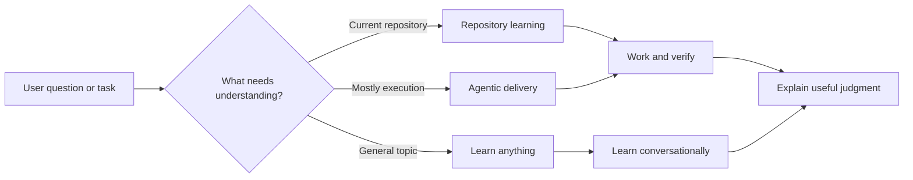
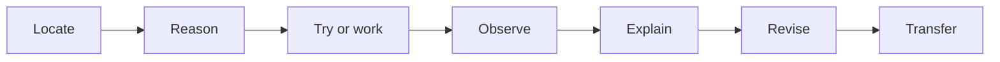

# Codebase Learning Flow

[](https://github.com/legrab/codebase-learning-flow/releases/latest)

> A small repository harness for learning real systems with AI while keeping human judgment in charge.

Codebase Learning Flow configures a host coding agent. It provides repository-local instructions, focused skills, learning surfaces, and private local continuity. It does **not** provide an agent runtime, sandbox, retry engine, or background worker.

> [!IMPORTANT]
> **Learning-aware behavior is enabled by default after installation**. That does not mean every task becomes a lesson. Routine work stays routine. Requests such as `help me understand <topic>` select the appropriate learning route; implementation work remains normal delivery with learning reinforcement only when useful. Proposed designs are hypotheses to check against repository evidence, not specifications to endorse.

> [!WARNING]
> The regulatory extension is a reasoning and workflow aid, not a compliance determination or substitute for qualified regulatory or quality expertise.


```mermaid
flowchart LR
    Q[User question or task] --> R{What needs understanding?}
    R -->|Current repository| C[Repository learning]
    R -->|General topic| G[Learn anything]
    R -->|Mostly execution| A[Agentic delivery]
    C --> W[Work and verify]
    G --> L[Learn conversationally]
    A --> W
    W --> H[Explain useful judgment]
    L --> H
```

## What gets installed

| Layer | Purpose |
|---|---|
| **Agentic Delivery** | collaboration, routing, verification, handoff |
| **Learning & Ownership** | repository learning, general learning, private continuity, durable knowledge |
| **Optional Risk Lenses** | regulatory, safety, security, or other domain guidance |

The layers are composable. Learning and risk guidance add to an existing workflow rather than becoming another workflow.

> [!TIP]
> The framework optimizes for ownership, not framework participation: understand the real system, make good decisions, verify AI output, manage failure, and retain enough knowledge to operate without the model.

<details>
<summary>How the default learning behavior works</summary>

The installed `AGENTS.md` connects the host repository to `agentic-flow`. The common instructions route understanding requests automatically:

- `help me understand ...`, `explain ...`, `teach me ...` → `learn-anything` for general topics
- questions about the current codebase → repository learning
- implementation work → normal delivery, with learning reinforcement when useful
- a proposed design or approach → treated as a hypothesis, checked against repository evidence before endorsement or implementation
- an open-ended consequential question → repository evidence is inspected first; the user is asked only the smallest question evidence cannot answer
- one consequential or ambiguous change → `structured-change` alongside the active route
- regulatory reasoning → the optional regulatory lens when installed

The agent should not turn every task into a lesson. Short questions can receive short answers. Mechanical work can stay mechanical. A check-back is used only when it can expose a mistaken model or improve the next decision.

</details>

## Installation

### Preferred: packaged release

For team or enterprise use, install a reviewed, versioned release. Substitute the current tag from the badge above or the [Releases page](https://github.com/legrab/codebase-learning-flow/releases).

`--release`/`-Release` intentionally has no `latest` shortcut, so the exact tag must be given.

```sh
curl -fsSL https://raw.githubusercontent.com/legrab/codebase-learning-flow/main/scripts/install.sh -o install.sh
sh install.sh --release v1.1.0 --profile minimal
```

```powershell
& ([scriptblock]::Create((irm https://raw.githubusercontent.com/legrab/codebase-learning-flow/main/scripts/install.ps1))) -Release v1.1.0 -Profile Minimal
```

The installer verifies the release checksum before extraction and reports the resolved `Version:` and `Source:`.

### Development checkout

```sh
curl -fsSL https://raw.githubusercontent.com/legrab/codebase-learning-flow/main/scripts/install.sh | sh
```

```powershell
& ([scriptblock]::Create((irm https://raw.githubusercontent.com/legrab/codebase-learning-flow/main/scripts/install.ps1)))
```

*For local development, use the installer scripts directly.*

<details>
<summary>Profiles, extensions, and update modes</summary>

| Choice | Meaning |
|---|---|
| `minimal` | daily use, smallest context surface |
| `full` | deliberate onboarding and deeper repository learning |
| `regulatory` | optional additive risk and traceability guidance |
| `update` | refresh framework-owned content while preserving repository-authored state |
| `merge` | add missing content without replacing existing content |
| `replace` | replace framework-managed directories and skills |

```sh
./scripts/install.sh --profile full
./scripts/install.sh --profile full --extension regulatory
./scripts/install.sh --mode update --profile full
```

A full-to-minimal update is rejected because automatic deletion could destroy repository-authored content. Removing an extension requires `update` or `replace`.

</details>

## Adoption

| Situation | Route |
|---|---|
| No existing agentic flow | Install `minimal`; add `full` or `regulatory` deliberately |
| Existing custom agentic flow | Use [`adoption/ADOPT.md`](adoption/ADOPT.md) and integrate only the useful layers |
| Existing lightweight flow | Add Learning & Ownership and relevant risk lenses without replacing delivery |

Complete installation consumes `sample/`. Guided adoption integrates selected concepts into an existing setup.

## Learning model

The shared educational constitution is installed as `agentic-flow/EDUCATION.md`.


```mermaid
flowchart LR
    S[Locate] --> R[Reason]
    R --> T[Try or work]
    T --> O[Observe]
    O --> E[Explain]
    E --> V[Revise]
    V --> X[Transfer]
```

The model is selective:

- keep the real business, scientific, human, or physical system primary;
- build judgment rather than dependence;
- use small, safe experiments when they clarify the model;
- question generated output, documentation, tests, and authority with evidence;
- distinguish fact, inference, and uncertainty;
- keep human control over consequential decisions;
- use at most one understanding check by default.

<details>
<summary>Ownership lens</summary>

When relevant:

| Question | Why |
|---|---|
| What real outcome matters? | prevents local code from becoming the whole problem |
| What rule or invariant must hold? | defines correctness |
| What evidence could disprove the model? | prevents confident guessing |
| How can it fail? | exposes containment and fallback needs |
| Who controls, validates, deploys, or accepts responsibility? | preserves human ownership |

*Low-risk work should not be forced through a safety or regulatory checklist.*

</details>

## Profiles and extensions

| Profile | Learning surface |
|---|---|
| `minimal` | one compact repository-learning skill |
| `full` | focused orientation, debugging, feature, refactor, and explanation skills |

Both use the same common educational constitution and agentic layer.

The only current extension is `regulatory`. It adds traceability, validation, risk management, audit trails, change control, and short standards orientation. It does not turn ordinary work into a compliance procedure.

## Private continuity

> [!NOTE]
> Learn locally first. Promote only reusable knowledge deliberately.

Meaningful sessions may use the ignored `.local/` workspace:

```text
.local/
├── learning-history.md
├── sessions/
└── follow-ups/
```

Only stable, verified, non-sensitive knowledge should move into tracked owners such as `learning-flow/MAP.md` or `learning-flow/TAKEAWAYS.md`.

## Installed shape

```text
agentic-flow/
learning-flow/
.agents/skills/
.local/
```

Task-specific templates live inside their owning skills and are materialized only when justified.

## Documentation

- [`docs/EDUCATION_MODEL.md`](docs/EDUCATION_MODEL.md) · learning and ownership model
- [`docs/README.md`](docs/README.md) · design and maintenance map
- [`scripts/README.md`](scripts/README.md) · installer lifecycle and safety behavior
- [`CHANGELOG.md`](CHANGELOG.md) · revision history
- [`LICENSE`](LICENSE) · licensing terms

<details>
<summary>Source layout</summary>

```text
sample/common/
sample/profiles/minimal/
sample/profiles/full/
sample/extensions/regulatory/
sample/root/
```

The common layer contains `agentic-flow`, `learn-anything`, `structured-change`, shared education guidance, and private-continuity defaults. Profiles add repository-learning depth; extensions add optional domain lenses.

</details>
