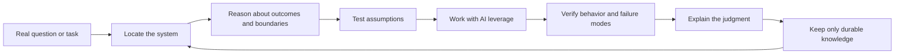
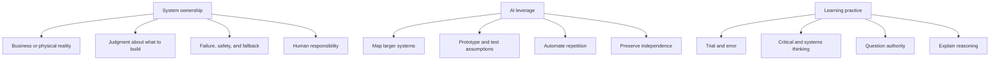
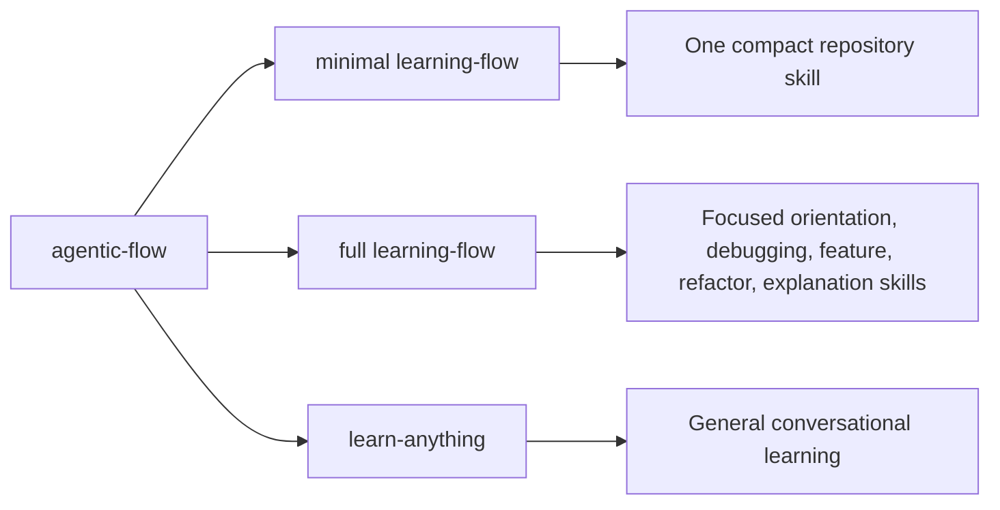

# Codebase Learning Flow

> A small repository harness for learning real systems, using AI aggressively, and keeping human judgment in charge.

Codebase Learning Flow configures a host coding agent. It does not provide its own runtime, sandbox, retry engine, or background worker. The repository supplies durable instructions, focused learning skills, and private local continuity.

> [!IMPORTANT]
> The target is not faster code generation by itself. The target is stronger ownership: understanding the business or physical system, choosing what should be built, validating generated work, managing failure, and retaining the ability to operate without the model.


```mermaid
flowchart LR
    Q[Real question or task] --> L[Locate the system]
    L --> R[Reason about outcomes and boundaries]
    R --> T[Test assumptions]
    T --> W[Work with AI leverage]
    W --> V[Verify behavior and failure modes]
    V --> E[Explain the judgment]
    E --> K[Keep only durable knowledge]
    K --> L
```

> [!WARNING]
> The regulatory extension is a reasoning and workflow aid, not a compliance determination or substitute for qualified regulatory/quality expertise.

## What this repository is

Codebase Learning Flow is both a working, literate example of repository-native agentic engineering and a reusable framework that can be installed into another repository.

The repository is intentionally literate: its documentation, workflow instructions, skills, examples, and validation describe how the system is supposed to work while also serving as the system being developed. The installable part packages the reusable behavior so another repository can adopt the useful pieces without having to adopt this repository's complete workflow.

The framework does not provide an agent runtime, sandbox, retry engine, or background worker. It configures a host coding agent through repository-local instructions, skills, learning surfaces, and optional risk lenses.

## Three layers

The framework has three explicit layers with different ownership and adoption boundaries:

| Layer | Purpose | Adoption boundary |
|---|---|---|
| **Agentic Delivery** | Common collaboration policy, task routing, verification, and handoff | Most invasive. A repository may use it as the common agentic baseline. |
| **Learning & Ownership** | Repository learning, general learning, private continuity, and durable knowledge | Independently adoptable into an existing agentic workflow. |
| **Optional Risk Lenses** | Regulatory, safety, security, or other domain-specific reasoning | Selective and additive. Never a replacement for the active workflow. |

The normal complete installation composes these layers, but they are not inseparable. In particular, a repository with an existing agentic workflow can adopt the learning or risk layers without replacing its own delivery model.

```text
Agentic Delivery
      │
      ├── may use ──► Learning & Ownership
      │
      └── may use ──► Optional Risk Lenses
                         │
                         └── elaborates the active workflow when relevant
```

This separation is deliberate. Adding a new learning or risk concern should not automatically create another global workflow layer or increase the amount of instruction every task must load.

## Instruction budget and workflow sanity

The framework treats agent context as a limited engineering resource. The common delivery layer is the baseline; learning and risk material are conditional branches. Ordinary work should select one primary task route, load only the narrow evidence it needs, reuse current findings, and stop when the evidence threshold is met. A skill must not become a second workflow merely because it is related to the task.

The framework is intentionally tested against representative low-risk, learning, consequential, and regulated scenarios to guard against the main failure mode: **making a competent developer perform framework rituals instead of making them faster and more aware**. See [`docs/AGENTIC_WORKFLOW_SANITY.md`](docs/AGENTIC_WORKFLOW_SANITY.md) for the context-budget rules and sanity scenarios.

## Installation

### Preferred: packaged release

For team and enterprise use, install a reviewed, versioned release rather than
executing a mutable checkout from `main`. Release installation will be the
preferred distribution path once packaged releases are published.

Pin the exact release version used by the team and retain the version in the
installation record.

### Development checkout

Run one installer from the repository that should receive the framework:


```powershell
& ([scriptblock]::Create((irm https://raw.githubusercontent.com/legrab/codebase-learning-flow/main/scripts/install.ps1)))
```

```sh
curl -fsSL https://raw.githubusercontent.com/legrab/codebase-learning-flow/main/scripts/install.sh | sh
```

Then give the agent the real task:

```text
Start with my current task. Quietly verify the installed workflow, surface only meaningful
instruction conflicts, and teach the relevant system, domain, and code path while working.
```

New installations use the compact `minimal` profile.

<details>
<summary>Windows Command Prompt and local installer commands</summary>

```bat
powershell -NoProfile -ExecutionPolicy Bypass -Command "iwr https://raw.githubusercontent.com/legrab/codebase-learning-flow/main/scripts/install.bat -OutFile '%TEMP%\install-learning-flow.bat'" && "%TEMP%\install-learning-flow.bat"
```

```powershell
./scripts/install.ps1 -Profile Minimal
./scripts/install.ps1 -Profile Full
./scripts/install.ps1 -Mode Update
```

```sh
./scripts/install.sh --profile minimal
./scripts/install.sh --profile full
./scripts/install.sh --mode update
```

Remote piping executes the referenced revision. Pin a release tag or commit for a team installation.

</details>

## Adoption situations

| Situation | Recommended approach | Installation / adoption procedure |
|---|---|---|
| **A. No agentic flow** | Complete installation with `minimal` by default; add `full` or `regulatory` deliberately. | Prefer a pinned packaged release. Use checkout installers for development or experimentation. |
| **B. Custom agentic flow per developer** | Preserve the existing delivery layer and selectively adopt learning/risk capabilities. | Check out this repository and run the guided adoption prompt from [`adoption/ADOPT.md`](adoption/ADOPT.md). |
| **C. Lightweight agentic flow, no learning/regulatory concepts** | Keep the existing delivery workflow and add the Learning & Ownership layer plus relevant risk lenses. | Prefer guided adoption; use complete installation only when the repository explicitly wants to standardize its delivery layer. |

Complete installation and guided adoption are intentionally different operations.
Complete installation consumes the framework payload under `sample/`; guided
adoption consumes the instructions under `adoption/` and integrates only the
selected concepts into an existing setup.

## Guided adoption for existing agentic setups

Check out this repository and ask the host coding agent to read
[`adoption/ADOPT.md`](adoption/ADOPT.md). The agent should inspect the existing
repository workflow, ask about profile and extension choices, propose a
minimal compatible integration, and wait for approval before consequential
changes.

The guided process considers `structured-change`, `learn-anything`,
`learning-closure`, `learning-freshness`, the Learning & Ownership model,
private `.local/` continuity, and relevant risk extensions. It does **not**
automatically install the common `agentic-flow` or rewrite the root
`AGENTS.md`.

## Choose the route

| You want to... | Route | What stays primary |
|---|---|---|
| understand or change the current repository | repository learning | the real engineering task |
| learn a general topic | `learn-anything` | the learner's question |
| configure or review the harness | `agentic-workflow` | repository collaboration policy |
| sequence one consequential, ambiguous, or regulated change | `structured-change` | the active route above, not a replacement for it |

For a general topic:

```text
Use learn-anything to help me understand <topic>. Keep it conversational, build a compact
system model, use one useful example or experiment, and let my questions steer the depth.
```

The general route does not inspect repository code. It can cover science, history, languages, arts, mathematics, teaching, or general technical ideas.

## What the framework optimizes for

| Human ownership | AI leverage | Resilient delivery |
|---|---|---|
| understand the larger system | map unfamiliar territory quickly | identify failure modes and safe boundaries |
| decide what should be built | prototype and compare options | validate generated solutions |
| question assumptions and authority | automate repetitive investigation | retain manual or operational fallback |
| articulate reasoning and tradeoffs | improve teaching material | control access and deployment |
| accept professional responsibility | build domain knowledge faster | integrate legacy and physical systems |

> [!TIP]
> AI should remove avoidable effort, not remove the learner from the causal chain. A useful session ends with a better model, stronger evidence, or clearer judgment, not merely more generated text.

## The learning compass

The shared educational constitution is installed as `agentic-flow/EDUCATION.md`. Each learning route selects only the lenses that improve the current task.


```mermaid
flowchart TB
    S[System ownership] --> B[Business or physical reality]
    S --> J[Judgment about what to build]
    S --> F[Failure, safety, and fallback]
    S --> H[Human responsibility]

    A[AI leverage] --> M[Map larger systems]
    A --> P[Prototype and test assumptions]
    A --> X[Automate repetition]
    A --> D[Preserve independence]

    L[Learning practice] --> E[Trial and error]
    L --> C[Critical and systems thinking]
    L --> Q[Question authority]
    L --> R[Explain reasoning]
```

### Priority ownership domains

The framework is repository-agnostic, but it asks deeper questions when work touches:

- laboratory software;
- industrial control and physical equipment;
- regulated or safety-relevant software (see the `regulatory` extension for the operational lens);
- security and access control;
- architecture and integration;
- verification and validation;
- education and assessment;
- human-machine workflow design.

These are lenses, not assumptions. A web utility does not need a pretend safety case. A laboratory controller should not be taught as if it were a CRUD demo.

<details>
<summary>Human educational value</summary>

When the topic involves teaching, teams, classrooms, onboarding, or assessment, the flow can also exercise:

- leadership and standard-setting;
- motivation without fake praise;
- social and group learning;
- noticing disengagement without diagnosing the learner;
- credible assessment based on demonstrated reasoning;
- trusted-adult responsibility and appropriate boundaries;
- judgment, not information transfer alone.

These concerns stay selective. They must not hijack a direct session goal or cause sensitive personal state to be persisted.

</details>

## Profiles

| Profile | Best for | Shared surfaces | Learning skills |
|---|---|---|---:|
| `minimal` | daily work, short engagements, token-sensitive agents | `MAP.md`, `TAKEAWAYS.md` | 1 repository skill |
| `full` | deliberate onboarding and long-lived ownership | map, takeaways, repository baselines | 7 focused skills |

Both profiles use the same common collaboration layer and educational constitution. Full mode adds narrower task skills and more structured orientation, not more ceremony by default.


```mermaid
flowchart LR
    C[agentic-flow] --> M[minimal learning-flow]
    C --> F[full learning-flow]
    C --> G[learn-anything]
    M --> P1[One compact repository skill]
    F --> P2[Focused orientation, debugging, feature, refactor, explanation skills]
    G --> P3[General conversational learning]
```

## Extensions

Extensions are additive and orthogonal to profile: they add capability without changing what `minimal` or `full` mean. The only extension today is `regulatory`.

| Extension | Adds | Never does |
|---|---|---|
| `regulatory` | `regulatory-knowledge` skill: traceability, validation, risk management, audit trails, change control, and short orientation to ISO 9001, ISO 13485, ISO 14971, ISO 17025, IEC 62304, and 21 CFR Part 11 | turn ordinary low-risk work into a compliance procedure |

```sh
./scripts/install.sh --profile full --extension regulatory
```

```powershell
./scripts/install.ps1 -Profile Full -Extension Regulatory
```

`--extension auto` (the default) keeps whatever is currently installed and defaults a fresh install to none. Removing an installed extension needs `update` or `replace` mode, the same restriction that applies to a destructive profile switch:

```sh
./scripts/install.sh --mode update --extension none
```

The Explore → Design → Approve → Implement → Review → Capture Knowledge sequence this extension plugs into is not extension-specific. It lives in `structured-change`, a common skill available with every profile, and elaborates one part of `agentic-flow/WORKFLOW.md`'s `Decide` step for the rare change that is architecturally significant, genuinely ambiguous, or regulated. The `regulatory` extension adds a lens to that same skill; it does not add a second workflow.

## Private continuity

> [!NOTE]
> Learn locally first. Promote only reusable knowledge deliberately.

Fresh installation creates an ignored repository-root `.local/` workspace:

```text
.local/
├── learning-history.md
├── sessions/
└── follow-ups/
```

Meaningful sessions may retain attempts, revised models, checks, and useful next directions. One-off answers and ordinary engineering tasks should not create learning artifacts.

Only stable, verified, non-sensitive knowledge is promoted into tracked owners such as `learning-flow/MAP.md` or `learning-flow/TAKEAWAYS.md`.

<details>
<summary>Update modes and root integration</summary>

Framework modes:

- `fail`: stop when managed content already exists;
- `merge`: add missing files and preserve existing content;
- `update`: refresh framework-owned files and skills while preserving settings, decisions, maps, takeaways, `.local/`, repository-authored content, and unrelated skills;
- `replace`: replace framework directories and this framework's managed skills.

Extensions follow the same modes: `--extension regulatory` adds it, `--extension none` in `update` or `replace` removes it, and `merge` never removes an installed extension.

A minimal installation can upgrade safely:

```sh
./scripts/install.sh --mode update --profile full
```

Full-to-minimal update is rejected because automatic deletion could destroy repository-authored content.

Root modes are `auto`, `integrate`, `initialize`, `preserve`, and `skip`:

```powershell
./scripts/install.ps1 -RootAgents Integrate
```

```sh
./scripts/install.sh --root-agents integrate
```

Existing root instructions are never replaced wholesale.

</details>

## Installed shape

```text
.local/
agentic-flow/
├── AGENTS.md
├── SETTINGS.md
├── WORKFLOW.md
├── EDUCATION.md
├── LEARN.md
├── LOCAL.md
└── DECISIONS.md
learning-flow/
├── AGENTS.md
├── MAP.md
├── TAKEAWAYS.md
└── REGULATORY.md         (only with --extension regulatory)
.agents/skills/
├── agentic-workflow/
├── learn-anything/
├── structured-change/
├── regulatory-knowledge/ (only with --extension regulatory)
└── profile-specific learning skills
```

Task-specific templates travel inside their owning skills and are materialized only when justified.

## Documentation

- [`docs/EDUCATION_MODEL.md`](docs/EDUCATION_MODEL.md): the human learning and ownership model
- [`docs/README.md`](docs/README.md): design and maintenance map
- [`scripts/README.md`](scripts/README.md): installer lifecycle and safety behavior
- [`CHANGELOG.md`](CHANGELOG.md): revision history
- [`LICENSE`](LICENSE): MIT software and CC BY 4.0 documentation and template terms
