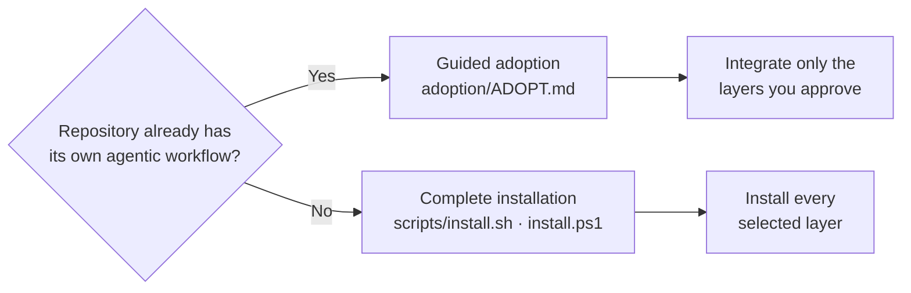

# Guided adoption

This directory is **not part of complete installation**. It is the repository's
guided adoption surface for repositories that already have their own agentic
workflow.

> [!IMPORTANT]
> `adoption/` must never cause the common `agentic-flow` to be installed automatically, or the target repository's root `AGENTS.md` to be rewritten without approval.

Directory boundaries

- `sample/` contains the framework payload used by complete installation.
- `adoption/` contains guidance for adapting selected framework concepts into an existing setup.
- `scripts/` contains installers for complete installation.

## Start adoption

Give the repository-aware coding agent this instruction:

> Read `adoption/ADOPT.md` in the Codebase Learning Flow repository. Inspect my
> existing repository-native agentic setup before changing anything. Treat this
> as guided adoption, not complete installation. Ask me about the meaningful
> choices, recommend compatible components, and integrate only what I approve.
> Preserve existing instructions and workflows unless I explicitly approve a
> change.

The agent should then follow `ADOPT.md`.

## What adoption can add

The primary candidates are:

- `structured-change`;
- `learn-anything`;
- `learning-closure`;
- `learning-freshness`;
- the Learning & Ownership model;
- private `.local/` continuity;
- `regulatory-knowledge` where relevant.

The common Agentic Delivery layer is intentionally not a default adoption target.
An existing repository may already have a better delivery workflow for its users.

## What adoption must preserve

Adoption must not:

- replace the existing agent runtime;
- silently replace the existing agentic workflow;
- automatically install `agentic-flow`;
- automatically rewrite the root `AGENTS.md`;
- overwrite repository-authored skills or documentation;
- create unnecessary framework ceremony.

If a proposed integration conflicts with an existing instruction, surface the
conflict and ask the user to choose rather than resolving it by silently giving
one instruction higher priority.
