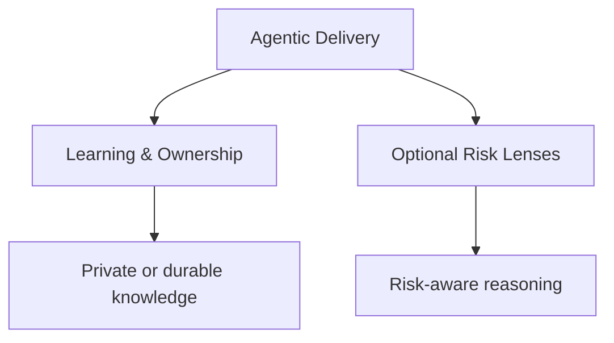
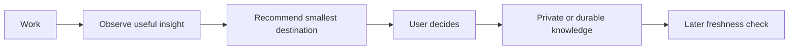

# Framework architecture

Codebase Learning Flow is organized as three layers with different ownership and adoption boundaries.

```text
Codebase Learning Flow
│
├── 1. Agentic Delivery
│   └── How the coding agent collaborates with the repository and humans
│
├── 2. Learning & Ownership
│   └── How the human builds understanding, judgment, and durable knowledge
│
└── 3. Optional Risk Lenses
    └── Regulatory, safety, security, or other domain-specific reasoning
```

## 1. Agentic Delivery

The agentic delivery layer is the common collaboration layer. It defines the default engineering loop, instruction precedence, planning and verification behavior, communication, handoff, and boundaries around consequential actions.

Its main installed surface is `agentic-flow/`.

This layer should remain small because it is the most invasive layer: its instructions influence ordinary coding-agent behavior. Repository-specific architecture rules and task-specific procedures belong elsewhere.

The default engineering loop is:

```text
Frame → Inspect → Decide → Act → Verify → Handoff
```

The loop is task-scaled. A trivial edit should not acquire a formal learning or change-management ceremony merely because the framework supports those things.

## 2. Learning & Ownership

The learning and ownership layer helps a developer understand the system while doing real engineering work and retain useful knowledge without turning every task into documentation.

Its surfaces include:

- `learning-flow/`;
- repository-learning skills;
- `learn-anything`;
- the learning model in `agentic-flow/EDUCATION.md`;
- private `.local/` continuity;
- durable maps and takeaways.

This layer is independently adoptable into an existing agentic workflow.

Conversation remains the default learning surface. Private continuity is used only when meaningful persistence is justified. Shared knowledge is promoted deliberately and should be stable, verified, reusable, and non-sensitive.

The learning layer should not become a second engineering workflow or silently introduce universal execution gates.

## 3. Optional Risk Lenses

Risk lenses add domain-specific reasoning to the active workflow without replacing it.

The current example is the `regulatory` extension and its `regulatory-knowledge` skill.

A risk lens may strengthen questions around:

- traceability;
- validation and verification;
- risk management;
- auditability;
- change control;
- safety;
- security;
- professional responsibility.

Risk lenses are selective. They should be activated when the work actually benefits from the lens, not merely because a repository contains a regulated or safety-relevant component.

For a consequential change, a risk lens can work with `structured-change`. It does not create a parallel workflow.

> [!WARNING]
> The regulatory extension is a reasoning and workflow aid, not a compliance determination or substitute for qualified regulatory/quality expertise.

## Layer relationships



A repository may therefore choose:

- **Agentic Delivery only** for a minimal coding-agent setup;
- **Agentic Delivery + Learning & Ownership** for the normal learning-oriented setup;
- **Agentic Delivery + Risk Lenses** when a specific domain requires stronger reasoning;
- **all three** when both learning and risk-aware engineering are useful.

Existing custom agentic workflows may also adopt Layer 2 or Layer 3 without adopting the framework's common Layer 1. This distinction matters for guided adoption.

<details>
<summary>Ownership boundaries</summary>

| Layer | Owns | Avoid turning it into |
|---|---|---|
| Agentic Delivery | common collaboration policy, task routing, verification, handoff | repository-specific architecture documentation or every task's learning procedure |
| Learning & Ownership | learning routes, durable understanding, private continuity, knowledge promotion | a mandatory lesson plan or universal execution gate |
| Optional Risk Lenses | domain-specific risk and evidence guidance | a claim of compliance, certification, or mandatory procedure for unrelated work |

The repository itself is the reference implementation of these boundaries. Changes should preserve the distinction rather than introduce a new cross-cutting framework layer for every concern.

</details>

<details>
<summary>Adoption versus installation</summary>

- **Complete installation** consumes the framework payload under `sample/` and establishes the selected layers.
- **Guided adoption** consumes `adoption/` and adapts selected concepts into an existing agentic setup. It must not silently replace the host delivery workflow or root `AGENTS.md`.

This separation is a trust and context boundary as well as an installation boundary.

</details>

## Learning lifecycle

Learning is treated as a lifecycle rather than a second engineering process:



`learning-closure` owns the placement decision at meaningful workflow closure. `learning-freshness` periodically checks internal documentation and learning claims against implementation evidence. External-source claims remain externally sourced and carry provenance for later revalidation.

The default is not to persist anything. Durable knowledge must earn its maintenance cost.
