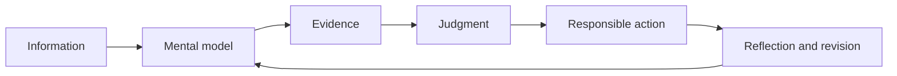
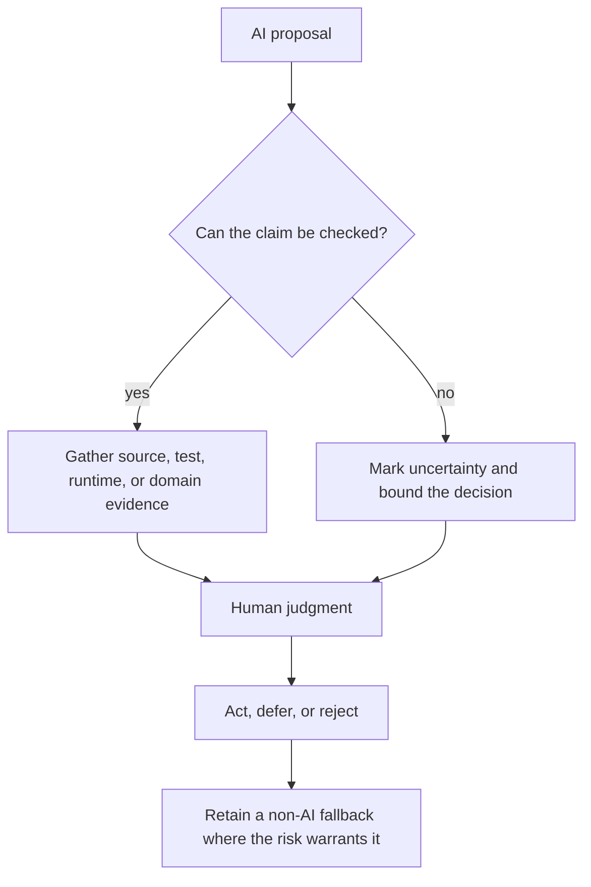
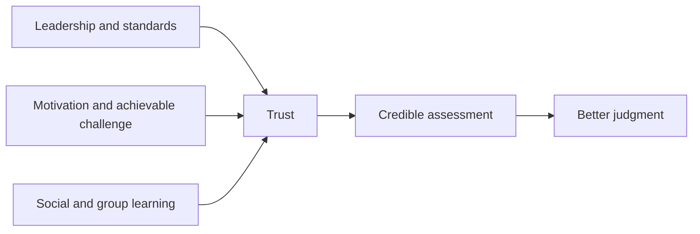

# Learning for durable human ownership

Codebase Learning Flow treats learning as an increase in responsible control over a system. The learner should be better able to explain it, change it, challenge it, verify it, and operate it when automation is unavailable or wrong.

> [!NOTE]
> The model is selective. A session uses the smallest set of lenses that improves the real goal. It is not a compulsory worksheet.

## From information to ownership



A useful learning outcome may be:

- a clearer causal model;
- a tested assumption;
- a safer design decision;
- a better explanation;
- a credible validation plan;
- a known failure boundary;
- a reusable domain insight;
- a deliberate decision not to build or automate something.

## AI leverage without dependency

AI is valuable for breadth, speed, and repetition. It is weak as an unaccountable authority.

| Use AI to... | Keep human control over... |
|---|---|
| map a large system | deciding which model is credible |
| propose prototypes | deciding what should exist |
| generate probes and test ideas | choosing decisive evidence |
| automate repetitive analysis | access, deployment, and rollback |
| improve examples and teaching material | credible assessment |
| connect domain vocabulary | legal and professional responsibility |
| maintain output with fewer resources | failure handling and fallback |



> [!CAUTION]
> Generated fluency is not validation. A learner who cannot describe the mechanism, evidence, boundary, and failure response does not yet own the result.

## Resilience and responsibility

Repository learning should drift away from framework trivia and toward the parts humans remain accountable for:

- the actual business or physical system;
- product and design judgment;
- validation of machine-generated work;
- safety, failure, recovery, and degraded modes;
- integration with old, external, or physical systems;
- legal and professional responsibility;
- negotiation among people with different incentives;
- access control, deployment authority, and rollback.

These questions are especially important in laboratory, industrial, regulated, security, integration, validation, educational, and human-machine workflow domains.

<details>
<summary>Compact resilience questions</summary>

Use only the relevant questions:

1. What real outcome does the system protect or produce?
2. What should remain a human decision?
3. What evidence would disprove the current model?
4. How can the system fail, and who notices?
5. What is the safe or useful degraded mode?
6. Which legacy, physical, organizational, or legal constraint controls the design?
7. Who can change, approve, deploy, stop, or roll back it?
8. What knowledge must remain usable without the current AI tool?

</details>

## Trial, error, flow, and articulation

The framework supports small safe experiments rather than passive consumption:

```text
Hypothesis → Small attempt → Observation → Explanation → Revision → Transfer
```

The learner should be able to say:

- what they expected;
- what happened;
- what changed in their model;
- which evidence matters;
- where the conclusion stops applying;
- what they would try next.

Authority can be questioned, including documentation, generated answers, tests, conventions, and senior opinions. The standard is not contrarianism. The standard is whether the claim survives relevant evidence and responsibility.

## Human educational value

When the subject includes classrooms, teams, onboarding, or assessment, teaching quality includes more than content transfer.



A capable teaching flow can:

- maintain clear standards without humiliation;
- support motivation through relevance, agency, and visible progress;
- organize useful group activity when the setting allows it;
- notice disengagement and adjust pacing without diagnosing the learner;
- assess demonstrated reasoning rather than confidence or compliance;
- act within trusted-adult and professional boundaries;
- teach judgment and responsibility, not merely recall.

Sensitive emotional, health, or personal information should not be inferred or persisted by default.

## What gets retained

Private learning continuity belongs in `.local/`. Shared records should contain only verified, reusable, non-sensitive knowledge.

A durable takeaway should usually answer a subset of:

- What is the system model?
- What judgment does it support?
- What evidence establishes it?
- What failure or boundary matters?
- What AI leverage is safe, and what fallback remains?
- Who owns the decision or control?
- Where does the insight transfer?

The operational version of this model is installed as `agentic-flow/EDUCATION.md`.
