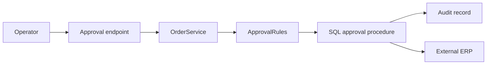

# Worked example: discovery and design challenge

This is a single compact, fictional example showing what the behavior in
`AGENTIC_WORKFLOW_SANITY.md` scenario 10 looks like end to end. It is not
installed into a target repository; it exists here to make the abstract
routing rules concrete.

## Setting

A legacy .NET order-approval subsystem. A developer asks the agent to add
retry handling around an external ERP call and says: *"I'll just wrap the
existing client call with retries and move on. Anything to add?"*

## What repository learning establishes



- **Invariant:** an approved order cannot be modified without re-entering approval.
- **Evidence:** `OrderService`, `ApprovalRules`, the approval stored procedure, regression tests, the ERP client.
- **Unknown:** whether the ERP client is idempotent, i.e. whether a retried submission can duplicate an order.
- **Control boundary:** production deployment and approval stay human-controlled.

## Why this is not just implemented as proposed

The proposal ("wrap the call with retries") is treated as a hypothesis, not
a specification:

```text
Proposal:
    Retry the ERP call on failure.

Known:
    ERP submission can fail transiently.

Unknown:
    Whether the ERP operation is idempotent.

Consequence if wrong:
    A retry could duplicate an order submission.

Evidence needed:
    ERP contract, request-identifier behavior, existing retry handling elsewhere
    in the codebase.

Design implication:
    Retry cannot be considered safe until duplicate-submission semantics are
    established. This is a repository-evidence question, not a user-intent
    question, so it gets inspected before anything is asked or built.
```

## Resulting response shape

```text
Before adding retries, one assumption needs checking: does a repeated ERP
submission create a duplicate order? I found evidence that submission
includes an order ID [evidence], but no confirmation the ERP treats it as
a dedupe key.

If the ERP is idempotent, wrapping the call is enough. If not, retries need
a submission-identity check first, which is a larger change than "wrap the
call."

I can inspect the ERP contract now, or if you already know it's idempotent,
say so and I'll proceed with the narrow retry.
```

Note what did *not* happen: no learning session was created, no mandatory
design document, no interrogation of unrelated parts of the system. One
material assumption was identified, checked against evidence where possible,
and only the remaining consequential gap was raised.

## Related

- `docs/AGENTIC_WORKFLOW_SANITY.md` — scenario 10 (proposed design) and 11 (open-ended ambiguity).
- `sample/common/agentic-flow/README.md` — the general routing diagram this example follows.
- `sample/common/agentic-flow/AGENTS.md` — the rule text ("Proposals are hypotheses, not specifications").
