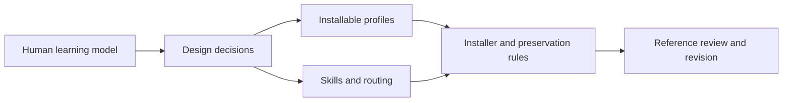

# Design and maintenance map

This directory explains why the framework is shaped this way, how to evolve it, and how outside ideas are evaluated without turning the repository into a harness catalogue.

> [!IMPORTANT]
> Changes should strengthen understanding, ownership, verification, or maintenance while keeping the common path small. A new framework layer must remove more complexity than it adds.

## Read by purpose

| Need | Start here |
|---|---|
| understand the educational direction | [`EDUCATION_MODEL.md`](EDUCATION_MODEL.md) |
| understand ownership and architecture decisions | [`DESIGN_NOTES.md`](DESIGN_NOTES.md) |
| reconstruct or adapt the framework | [`INITIALIZE_LEARNING_FLOW.md`](INITIALIZE_LEARNING_FLOW.md) |
| integrate an external source | [`references/REFERENCE_INTEGRATION.md`](references/REFERENCE_INTEGRATION.md) |
| inspect installer behavior | [`../scripts/README.md`](../scripts/README.md) |

External reference reviews

- [`Awesome Agent Skills`](references/REFERENCE_REVIEW_AWESOME_AGENT_SKILLS.md)
- [`Best of Agent Harnesses`](references/REFERENCE_REVIEW_BEST_OF_AGENT_HARNESSES.md)
- [`Goose`](references/REFERENCE_REVIEW_GOOSE.md)
- [`Pocok`](references/REFERENCE_REVIEW_POCOK.md)
- [`Litt`](references/REFERENCE_REVIEW_LITT.md)

A reference is evidence, not a target architecture. Keep exact provenance, name value already covered locally, and retain only the smallest gap-closing delta.

## Maintainer checklist

1. Keep generic learning and repository learning behaviorally aligned through `sample/common/agentic-flow/EDUCATION.md`.
2. Keep direct engineering behavior in `agentic-flow/` and task procedures in skills.
3. Keep `.local/` private, ignored, and optional.
4. Preserve repository-authored maps, takeaways, settings, and unrelated skills during updates.
5. Validate both minimal and full installations after changing manifests or managed files.
6. Review the human entry points after structural changes. The root README should remain useful before any agent-facing detail is read.
