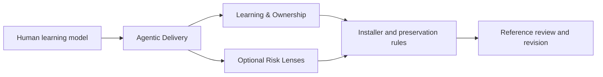

# Design and maintenance map

This directory explains why the framework is shaped this way, how to evolve it,
and how outside ideas are evaluated without turning the repository into a
harness catalogue.

```mermaid
flowchart LR
    H[Human learning model] --> A[Agentic Delivery]
    A --> L[Learning & Ownership]
    A --> R[Optional Risk Lenses]
    L --> V[Installer and preservation rules]
    R --> V
    V --> C[Reference review and revision]
```

> [!IMPORTANT]
> Changes should strengthen understanding, ownership, verification, or
> maintenance while keeping the common path small. A new framework layer must
> remove more complexity than it adds.

## Architecture

[`ARCHITECTURE.md`](ARCHITECTURE.md) is the canonical description of the
framework's three layers:

1. **Agentic Delivery**: common coding-agent collaboration behavior.
2. **Learning & Ownership**: learning, continuity, and durable knowledge.
3. **Optional Risk Lenses**: selective regulatory, safety, security, or similar
   domain guidance.

The layers have different adoption boundaries. Learning and risk guidance may
be adopted into an existing agentic workflow without replacing that workflow.

## Read by purpose

| Need | Start here |
|---|---|
| understand the framework architecture | [`ARCHITECTURE.md`](ARCHITECTURE.md) |
| understand the educational direction | [`EDUCATION_MODEL.md`](EDUCATION_MODEL.md) |
| understand ownership and historical architecture decisions | [`DESIGN_NOTES.md`](DESIGN_NOTES.md) |
| reconstruct or adapt the framework | [`INITIALIZE_LEARNING_FLOW.md`](INITIALIZE_LEARNING_FLOW.md) |
| see the proposal-challenge and ambiguity routing behavior in a worked example | [`EXAMPLE_WALKTHROUGH.md`](EXAMPLE_WALKTHROUGH.md) |
| integrate an external source | [`references/REFERENCE_INTEGRATION.md`](references/REFERENCE_INTEGRATION.md) |
| inspect installer behavior | [`../scripts/README.md`](../scripts/README.md) |

External reference reviews

- [`Awesome Agent Skills`](references/REFERENCE_REVIEW_AWESOME_AGENT_SKILLS.md)
- [`Best of Agent Harnesses`](references/REFERENCE_REVIEW_BEST_OF_AGENT_HARNESSES.md)
- [`Goose`](references/REFERENCE_REVIEW_GOOSE.md)
- [`Learning flow adjustment for regulatory`](references/REFERENCE_REVIEW_LEARNING_FLOW_ADJUSTMENT.md)
- [`Pocok`](references/REFERENCE_REVIEW_POCOK.md)
- [`Litt`](references/REFERENCE_REVIEW_LITT.md)

A reference is evidence, not a target architecture. Keep exact provenance, name
value already covered locally, and retain only the smallest gap-closing delta.

## Agentic workflow sanity checks

Use [`AGENTIC_WORKFLOW_SANITY.md`](AGENTIC_WORKFLOW_SANITY.md) when changing common agent instructions or broadly loaded skills. It defines the context-budget rules and representative scenarios used to detect framework ritual and context-overflow regressions.

## Maintainer checklist

1. Keep generic learning and repository learning behaviorally aligned through
   `sample/common/agentic-flow/EDUCATION.md`.
2. Keep common engineering behavior in the Agentic Delivery layer and task
   procedures in skills.
3. Keep Learning & Ownership independently adoptable and avoid making it a
   universal execution gate.
4. Keep Optional Risk Lenses selective and additive.
5. Keep `.local/` private, ignored, and optional.
6. Preserve repository-authored maps, takeaways, settings, and unrelated skills
   during updates.
7. Validate both minimal and full installations after changing manifests or
   managed files.
8. Review the human entry points after structural changes. The root README
   should remain useful before any agent-facing detail is read.

## Current architecture boundaries

The framework is organized into three layers:

1. Agentic Delivery;
2. Learning & Ownership;
3. Optional Risk Lenses.

Complete installation uses the payload under `sample/`. Guided adoption uses the
separate `adoption/` surface and integrates only selected concepts into an
existing agentic workflow.

Meaningful workflow closure can invoke `learning-closure` to decide whether a
useful insight belongs in private continuity, a learning-flow surface, or
module
documentation. `learning-freshness` provides a periodic internal consistency
check; external-source claims require retained provenance and external
revalidation.
