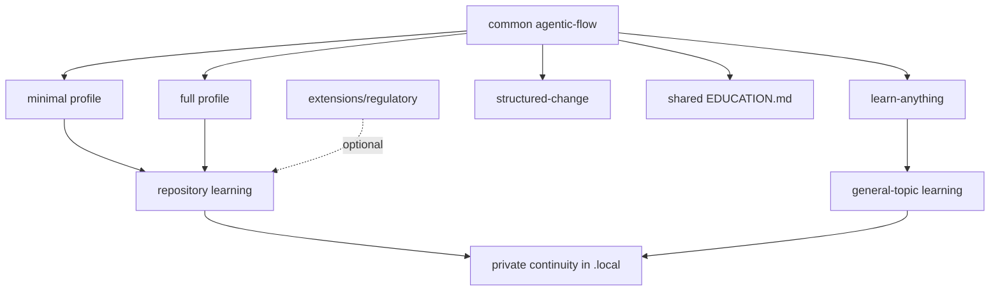

# Installable framework layers

The installer combines one common collaboration layer with one learning profile.


```mermaid
flowchart TB
    C[common agentic-flow] --> M[minimal profile]
    C --> F[full profile]
    C --> G[learn-anything]
    C --> SC[structured-change]
    C --> E[shared EDUCATION.md]
    M --> L[repository learning]
    F --> L
    G --> N[general-topic learning]
    L --> P[private continuity in .local]
    N --> P
    Ext[extensions/regulatory] -.optional.-> L
```

## Source layout

```text
sample/common/agentic-flow/
sample/common/.agents/skills/agentic-workflow/
sample/common/.agents/skills/learn-anything/
sample/common/.agents/skills/structured-change/
sample/common/.agents/skills/repository-learning/
sample/common/local/learning-history.md
sample/profiles/minimal/
sample/profiles/full/
sample/extensions/regulatory/
sample/root/
```

| Layer | Responsibility |
|---|---|
| `agentic-flow/` | planning, autonomy, validation, records, and handoff |
| `agentic-flow/EDUCATION.md` | system ownership, resilience, AI independence, and teaching judgment |
| `learning-flow/` | repository education, profile routing, and durable shared knowledge |
| `learn-anything` | conversational learning without repository inspection |
| `structured-change` | Explore/Design/Approve sequencing for one consequential change, any profile |
| `extensions/regulatory` | optional, additive traceability/validation/risk-management knowledge |
| `.local/` | private sessions, attempts, checks, progress, and follow-ups |

> [!IMPORTANT]
> Learning routes share educational principles but not repository assumptions. General learning remains safe for history, science, languages, arts, teaching, and other non-code topics.

Fresh installs default to the minimal profile. Existing installations retain their profile. Minimal can upgrade to full through update mode. Full cannot reduce to minimal without replace mode.

<details>
<summary>Root integration</summary>

- `sample/root/AGENTS.md` is the lean root template for repositories without instructions.
- `sample/root/AGENTS.pointer.md` is the idempotent block used to connect existing instructions.
- Existing root content is never replaced wholesale.
- Interactive setup offers linked, pending-review, and explicit-only outcomes.
- The result is recorded in settings and can be revised through `agentic-workflow`.

</details>

<details>
<summary>Extensions</summary>

- `sample/extensions/regulatory/` layers `learning-flow/REGULATORY.md` and the `regulatory-knowledge` skill on top of either profile.
- Extensions never change what a profile means and never appear unless requested via `--extension regulatory`.
- Fresh installs default to no extension. Existing installations retain their selection.
- Removing an installed extension requires `update` or `replace` mode, the same restriction that applies to a destructive profile switch.

</details>

The common layer also includes `REFERENCE_INTEGRATION.md` for learning from outside repositories or ZIPs without copying source-specific policy.
