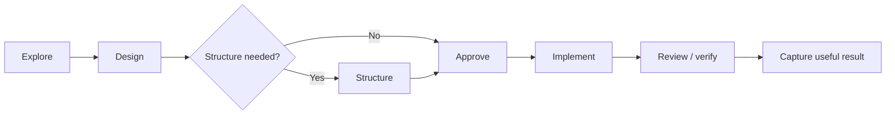

# Structured change

Read `agentic-flow/AGENTS.md` and the relevant `WORKFLOW.md` sections. Read `SETTINGS.md` only when the preset affects the decision.

## Use when

- the change is architecturally significant, hard to reverse, or spans owners;
- credible options remain unresolved by evidence;
- `gated` mode or the user explicitly requests a design review or migration plan;
- installed regulatory guidance applies to validated, safety-relevant, or audited behavior.

Skip it for routine, small, reversible, or unambiguous work.

## Explore

State current behavior, purpose, constraints, unknowns, and affected risks. Separate facts from assumptions. Stop here.

When genuinely competing approaches exist, keep exploration findings shared across all of them. Branch only in Design, where tradeoffs actually differ.

## Design

Compare credible options, select an approach, name the remaining decision, and state verification and rollback where genuinely needed.

For ordinary engineering tradeoffs (architecture, dependency management, documentation, maintainability, modernization, testing, AI-collaboration), consult the relevant file under `knowledge/engineering/` instead of reasoning from first principles. Read only the file the decision needs.

If regulatory guidance applies, read only the specific knowledge needed and note traceability, validation impact, and requirement linkage. Do not invent compliance language.

## Structure (optional)

For a design with real architectural impact, answer before detailed planning:

- What are the major implementation units?
- How do they depend on each other?
- What changes together, and what must stay separate?
- What order makes verification possible at each step?

Skip this for a design that's already one clear unit of work; go straight to Approve.

## Approve

State the decision plainly and wait before implementing when approval is actually unresolved. An explicit prior instruction that resolves the decision is approval.

## Implement and review

Follow the normal workflow. Note deviations. For multi-commit work, review each meaningful commit against the approved design.

## Capture

Fold the result into the normal handoff. Record a durable decision only when it will matter later. Keep deferred improvements in `Open` or `DECISIONS.md`, not a new tracker.

## Scale

Keep low-risk work conversational. Use written templates only when the change's risk, duration, or handoff justifies them.

## Restraint

One structured decision per change. Do not stack a second formal process on top. Prefer the simplest acceptable solution.
