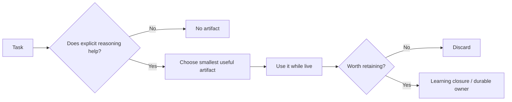

# Learning and reasoning artifacts

Optional vocabulary for making reasoning explicit. These are not workflow stages. A trivial task produces none; a consequential task might produce two or three.

## Types

- **question** — a specific thing that needs an answer before proceeding.
- **research** — what is true today, established from evidence.
- **model** — current understanding of a system: components, relationships, ownership, invariants, evidence, unknowns.
- **design** — what should change, and why.
- **structure** — the major implementation units for a design and how they depend on each other.
- **plan** — file-level or step-level execution order.
- **verification** — what was checked and how.
- **learning** — a durable insight worth persisting.

## Artifact rule

Create an artifact when making reasoning explicit materially improves correctness, communication, or future reuse. Do not create one merely because the framework has a place to put it.



A trivial fix produces zero artifacts. An unfamiliar, consequential change might produce a `model` and a `design`; it does not need all eight types.

<details>
<summary>Model</summary>

Use when accumulated understanding is worth exposing so the user can correct it before more reasoning builds on top of it. Keep it inline in the conversation unless the work is meaningful enough for `agentic-flow/LOCAL.md` continuity.

```text
Current model:
    <components and relationships, as a short flow or list>

Evidence:
    <files, tests, or configuration establishing this>

Unknown:
    <the highest-value open question>
```

Do not let a model accumulate unbounded state. If it stops fitting in a few lines, it has stopped being "current understanding" and started being documentation. Move stable parts to `learning-flow/MAP.md` through the normal promotion threshold in `LOCAL.md`, and keep only what is still live.

</details>

<details>
<summary>Structure</summary>

Use only inside `structured-change`, between Design and Implement, for a design with real architectural impact. See `.agents/skills/structured-change/SKILL.md`.

</details>

## Refining an artifact

If the user challenges a `model` or `design`, update it in place instead of restarting the task. See "Human correction propagation" in `agentic-flow/LOCAL.md`.
