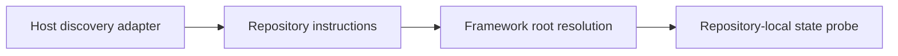

# Host discovery integration

Framework storage and host discovery are separate contracts. Installing files
under `~/.agents/` does not prove that an agent host will automatically read
them.



## Contract

1. Use the host's documented project instruction source when the repository
   carries root instructions.
2. For a global installation, configure one short account- or user-level
   adapter that points to the framework root. Do not copy framework policy into
   every repository.
3. Keep repository precedence unchanged: repository `agentic-flow/` and
   `learning-flow/` win; otherwise use `~/.agents/`.
4. Repository state remains in the repository. Before repository learning,
   continuation, or persistence, directly inspect `.local/`, `learning-flow/`,
   and `agentic-flow/`; search results alone cannot establish absence.
5. Verify the adapter in a fresh session. The host should identify the resolved
   framework root and existing repository state without creating replacement
   records.

## Cursor

Cursor documents project-tree `AGENTS.md` and User Rules as instruction
sources. A global Codebase Learning Flow installation therefore needs a Cursor
User Rule (or an equivalent supported account-level rule). Use this compact
adapter and let the referenced files own the detailed policy:

```text
Read root and nested repository instructions first. Resolve agentic-flow/ and
learning-flow/ from the repository root when present, otherwise from
~/.agents/ (%USERPROFILE%\.agents\ on Windows).

For repository learning, onboarding, or continuation, directly inspect the
repository-root .local/, learning-flow/, and agentic-flow/ paths before relying
on glob or indexed-search results. Read .local/learning-history.md first when
present, then only relevant maps and recent session state. Before creating or
replacing a learning record, read the exact destination and preserve its
documented owner.
```

Review the rule before saving it. The installer deliberately does not edit
Cursor account settings.

## Other hosts

Use the host's documented global or user instruction mechanism to provide the
same bridge. If the host has no such mechanism, use repository root
instructions or invoke the framework explicitly; do not claim that global
storage is self-discovering.
