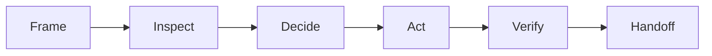
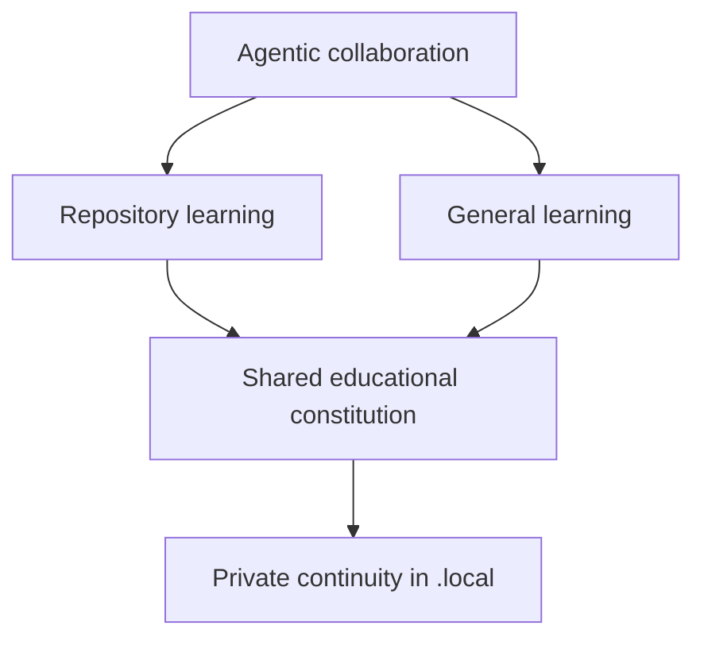

# Agentic flow

A compact repository-native collaboration layer:

It governs planning, autonomy, validation, records, and handoff. Repository-specific architecture and safety rules remain in native instructions.

Learning is attached without becoming a second delivery workflow:

> [!IMPORTANT]
> This layer configures a host agent. It does not provide a tool runtime, sandbox, retry engine, or durable task resumption.

Start with `AGENTS.md`. Use balanced defaults from `SETTINGS.md` unless configuration matters.

## Supporting guides

| Guide | Purpose |
|---|---|
| `WORKFLOW.md` | execution loop, evidence labels, and handoff |
| `CONFIGURE.md` | collaboration presets and optional overrides |
| `EDUCATION.md` | durable ownership, AI leverage, resilience, and teaching judgment |
| `LEARN.md` | understanding the effective repository harness |
| `LOCAL.md` | private learning continuity and deliberate promotion |
| `ROOT_INTEGRATION.md` | connecting existing or missing root instructions |
| `REFERENCE_INTEGRATION.md` | extracting value from another source |

Boundary in one sentence

`agentic-flow/` controls how work is performed. `learning-flow/` and learning skills control how understanding is built through that work.

