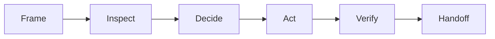
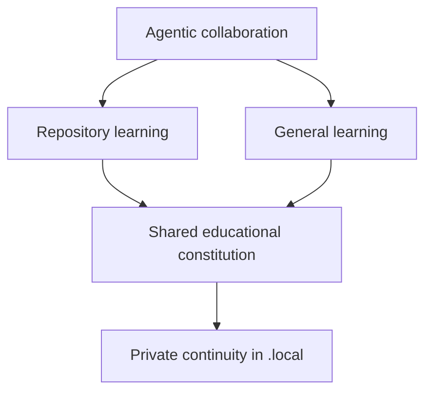
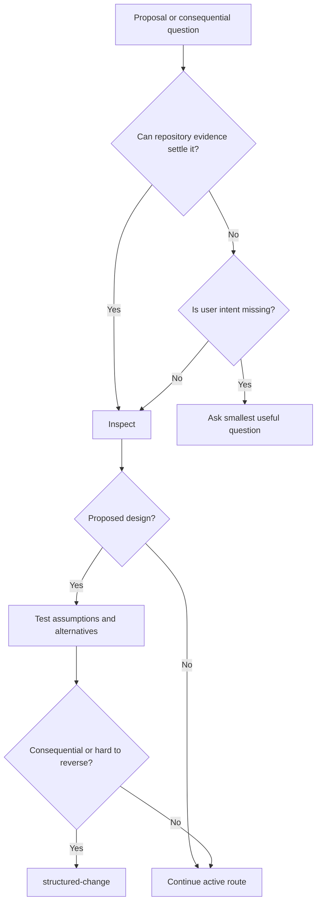

# Agentic flow

A compact repository-native collaboration layer:

```mermaid
flowchart LR
    F[Frame] --> I[Inspect]
    I --> D[Decide]
    D --> A[Act]
    A --> V[Verify]
    V --> H[Handoff]
```

It governs planning, autonomy, validation, records, and handoff. Repository-specific architecture and safety rules remain in native instructions.

Learning is attached without becoming a second delivery workflow:

```mermaid
flowchart TB
    C[Agentic collaboration] --> R[Repository learning]
    C --> G[General learning]
    R --> E[Shared educational constitution]
    G --> E
    E --> L[Private continuity in .local]
```

> [!IMPORTANT]
> This layer configures a host agent. It does not provide a tool runtime, sandbox, retry engine, or durable task resumption.

Start with `AGENTS.md`. Use balanced defaults from `SETTINGS.md` unless configuration matters.

## Proposal and ambiguity routing

A proposed design and an open-ended consequential question share the same first move: inspect what repository evidence can settle. They diverge when the remaining uncertainty is about user intent or about the proposed approach itself.

```mermaid
flowchart TD
    Q[Proposal or consequential question] --> E{Can repository evidence settle it?}
    E -->|Yes| I[Inspect]
    E -->|No| U{Is user intent missing?}
    U -->|Yes| A[Ask smallest useful question]
    U -->|No| I
    I --> D{Proposed design?}
    D -->|Yes| H[Test assumptions and alternatives]
    D -->|No| Act[Continue active route]
    H --> R{Consequential or hard to reverse?}
    R -->|Yes| SC[structured-change]
    R -->|No| Act
```

New evidence can change the route mid-task. This is a set of behavioral rules, not a fixed sequence. See `AGENTS.md` for the full rule text.

## Supporting guides

| Guide | Purpose |
|---|---|
| `WORKFLOW.md` | execution loop, evidence labels, and handoff |
| `CONFIGURE.md` | collaboration presets and optional overrides |
| `EDUCATION.md` | durable ownership, AI leverage, resilience, and teaching judgment |
| `LEARN.md` | understanding the effective repository harness |
| `LOCAL.md` | private learning continuity and deliberate promotion |
| `ROOT_INTEGRATION.md` | connecting existing or missing root instructions |
| `REFERENCE_INTEGRATION.md` | extracting value from another source |
| `learn-anything` | general-topic learning without repository inspection |

Boundary in one sentence

`agentic-flow/` guides how work is performed. `learning-flow/` and learning skills guide how understanding is built through that work.

## Learning lifecycle

`learning-closure` decides whether a meaningful change produced reusable knowledge and recommends the smallest appropriate persistence surface. `learning-freshness` can later cross-check durable repository knowledge against current implementation evidence. Neither is a second delivery workflow.
