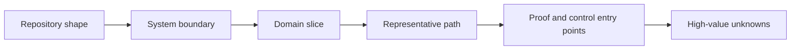

# Compact repository learning baseline

Use this only for a requested first map population or deliberate refresh. It creates a useful ownership map, not a repository inventory or curriculum.

## Constraints

- Follow repository instructions, `agentic-flow/AGENTS.md`, `agentic-flow/EDUCATION.md`, and `learning-flow/AGENTS.md`.
- Do not modify application code unless explicitly combined with implementation.
- Do not pre-generate personal tracking, sessions, explainers, labs, research, or learning materials.
- Do not exhaustively reread known managed template files.

## Procedure

1. Inspect repository shape, entry points, existing documentation, build and test commands, and relevant configuration.
2. Recognize template markers and root integration quietly.
3. Record only consequential custom instruction exceptions.
4. Identify the real business, scientific, human, or physical system when evidence supports it.
5. Populate `MAP.md` with major boundaries, one compact domain slice, one representative path, proof entry points, and high-value unknowns.
6. Add access, deployment, failure, validation, or fallback boundaries only when relevant.
7. Record repository identity in `REPOSITORIES.md` only when useful.
8. Add `TAKEAWAYS.md` entries only when they already meet the persistence threshold.
9. Stop.

## Completion report

Report:

- map entry point;
- system and domain boundary;
- representative path;
- build, run, debug, and proof entry points;
- important control or failure boundary when relevant;
- uncertain claims;
- one useful next task when obvious.
