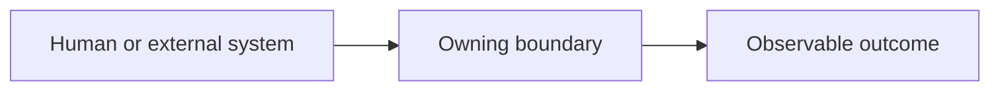

# Repository map

Keep this file compact and visual. It is an ownership surface, not an inventory.

## Agentic setup exceptions

_None known. Treat managed content as known. Add only custom instructions, unresolved precedence, meaningful overlap, or stale state that will affect future work._

## System boundaries

_Replace or remove the placeholder when a useful boundary is mapped._

## Domain slices

Add one row per relevant territory, not a comprehensive glossary.

| Actor and outcome | Business or physical system | Capability and invariant | Failure, control, or fallback | Owning boundary and evidence |
|---|---|---|---|---|
| _Not mapped yet._ | | | | |

## Representative paths

_Not mapped yet._

## Build, run, debug, and proof entry points

_Not mapped yet._

## Access, deployment, rollback, and operational seams

_Not mapped yet. Add only when relevant._

## Related repositories, legacy systems, and physical integration

_Not mapped yet._

## AI leverage and independent capability

_Not mapped yet. Record only reusable leverage plus the evidence, manual path, or reconstruction knowledge needed to avoid dependency._

## High-value unknowns

- _Add only unknowns likely to affect near-term work, validation, resilience, or ownership._

## Learning coverage

_Optional. Add only for a deliberate structured learning program._
