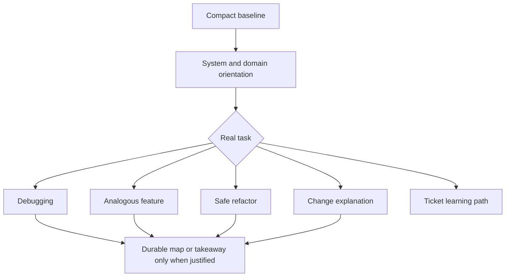

# Full learning flow

A focused repository-learning profile for deliberate onboarding and long-lived ownership. It adds narrower skills, not a second collaboration engine.

All skills apply `agentic-flow/EDUCATION.md` selectively. The goal is durable human ownership: system understanding, product judgment, credible validation, resilience, responsible AI leverage, and clear control boundaries.

## Persistent surfaces

| Surface | Purpose |
|---|---|
| `MAP.md` | compact systems, boundaries, controls, representative paths, and high-value unknowns |
| `TAKEAWAYS.md` | verified reusable models, judgments, evidence, and failure boundaries |
| `REPOSITORIES.md` | repository identities, baselines, and access boundaries |
| `.local/` | private sessions, attempts, progress, uncertainty, and follow-ups |

> [!IMPORTANT]
> Task-specific templates travel inside their owning skills. Do not pre-create curricula, labs, personal tracking, explainers, or research folders.

## Start

Use `learning-bootstrap` only for a requested baseline or deliberate onboarding pass. An ordinary task in a new repository can start with its matching task skill.

Select one primary learning skill. `agentic-workflow` is only for configuring or understanding the harness itself.

Skill routes

| Need | Skill |
|---|---|
| compact baseline | `learning-bootstrap` |
| architecture or domain orientation | `repository-orientation` |
| bug or failing behavior | `challenge-debugging` |
| feature based on existing behavior | `analogous-feature` |
| behavior-preserving structural change | `safe-refactor` |
| non-trivial diff or generated change | `change-explainer` |
| context before implementation | `ticket-learning-path` |

## Understanding and assessment

Use at most one brief open checkpoint by default when a mistaken model would affect future reasoning. Credible evidence includes explanation, prediction, trace, comparison, corrected attempt, boundary identification, or transfer.

A declined check never blocks engineering. Confidence, agreement, and polished wording are not proof.

## Artifact budget

Create or update a tracked artifact only when the result is:

- verified;
- repository-specific;
- reusable;
- costly enough to rediscover;
- non-sensitive;
- owned by exactly one surface.

## Communication

Lead with a compact system model or result. Use small visuals when they reduce prose. Keep safety, failure, access, deployment, responsibility, and uncertainty visible when relevant. Fold learning into the normal handoff instead of adding a ceremonial recap.
