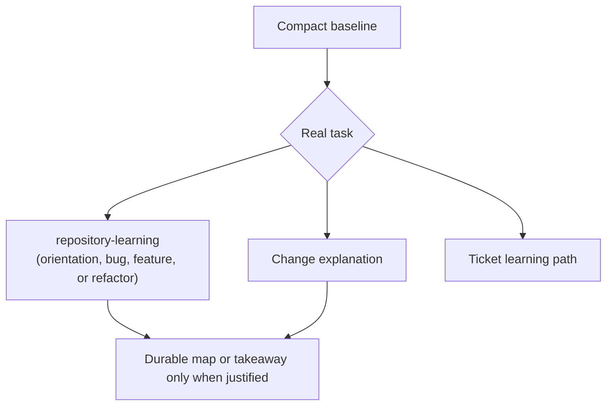

# Full learning flow

A focused repository-learning profile for deliberate onboarding and long-lived ownership. It adds deeper task skills, not a second collaboration engine.

```mermaid
flowchart TB
    B[Compact baseline] --> T{Real task}
    T --> L["repository-learning<br/>(orientation, bug, feature, or refactor)"]
    T --> X[Change explanation]
    T --> P[Ticket learning path]
    L --> K[Durable map or takeaway only when justified]
    X --> K
```

All selected skills apply `agentic-flow/EDUCATION.md` selectively. The goal is durable human ownership: system understanding, product judgment, credible validation, resilience, responsible AI leverage, and clear control boundaries.

## Persistent surfaces

| Surface | Purpose |
|---|---|
| `MAP.md` | compact systems, boundaries, controls, representative paths, and high-value unknowns |
| `TAKEAWAYS.md` | verified reusable models, judgments, evidence, and failure boundaries |
| `REPOSITORIES.md` | repository identities, baselines, and access boundaries |
| `.local/` | private sessions, attempts, progress, uncertainty, and follow-ups |

> [!IMPORTANT]
> Task-specific templates travel inside their owning skills. Do not pre-create curricula, labs, personal tracking, explainers, or research folders.

## Start

Use `learning-bootstrap` only for a requested baseline or deliberate onboarding pass. An ordinary task in a new repository can start with its matching repository-learning branch.

Select one primary learning skill. `agentic-workflow` is only for configuring or understanding the harness itself. See the "Select one primary skill" table in `learning-flow/AGENTS.md` for the full need-to-skill routing.

## Understanding and assessment

See "Understanding checks" in `learning-flow/AGENTS.md` for the governing rule and check techniques. A declined check never blocks engineering.

## Artifact budget

Create or update a tracked artifact only when the result is:

- verified;
- repository-specific;
- reusable;
- costly enough to rediscover;
- non-sensitive;
- owned by exactly one surface.

## Communication

Lead with a compact system model or result. Use small visuals when they reduce prose. Keep safety, failure, access, deployment, responsibility, and uncertainty visible when relevant. Fold learning into the normal handoff instead of adding a ceremonial recap.
