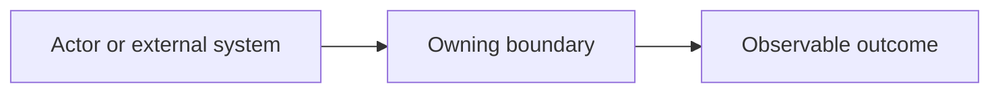

# Repository map

Keep this file compact and visual. It is a system ownership surface, not a file inventory.

## Agentic setup exceptions

_None known. Add only repository-specific instructions, unresolved precedence, meaningful overlap, or stale state that will affect future work._

## System boundary

_Replace or remove the placeholder when a useful boundary is mapped._

## Domain slices

Add one row only when it improves current or near-term work.

| Actor and outcome | Business or physical system | Capability and invariant | Failure, control, or fallback | Owner and evidence |
|---|---|---|---|---|
| _Not mapped yet._ | | | | |

## Representative paths

_Not mapped yet._

## Build, run, debug, and proof entry points

_Not mapped yet._

## Access, deployment, and operational boundaries

_Not mapped yet. Add only when relevant._

## AI leverage and independence

_Not mapped yet. Record only reusable ways AI accelerates work plus the evidence or fallback needed to avoid dependency._

## High-value unknowns

- _Add only unknowns likely to affect near-term work, safety, ownership, or validation._
