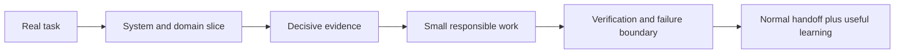

# Minimal learning flow

A compact repository-learning layer for daily work. It strengthens system ownership without creating a parallel course or documentation bureaucracy.

Use the `repository-learning` skill for orientation, a bug, an analogous feature, a safe refactor, or a non-trivial mechanism. Planning, approvals, validation depth, and delivery remain governed by `agentic-flow/`.

> [!IMPORTANT]
> The route applies `agentic-flow/EDUCATION.md` selectively. It should improve judgment, resilience, AI independence, and domain ownership only where those lenses matter to the task.

## Shared surfaces

| Surface | Keep |
|---|---|
| `MAP.md` | compact system boundaries, domain slices, controls, and representative paths |
| `TAKEAWAYS.md` | verified lessons that are reusable and costly to rediscover |
| `.local/` | private attempts, progress, uncertainty, checks, and session continuity |

The initial baseline recognizes managed setup quietly. It maps custom instructions, precedence, or stale evidence only when they affect future work.

Interaction and persistence

- Ask at most one consequential understanding check.
- Skip checks for mechanical work or already-demonstrated understanding.
- Use safe trial and error when it narrows the model.
- Fold useful learning into the normal handoff instead of adding a second recap.
- Promote only stable, repository-specific, non-sensitive knowledge.
- Keep personal state and raw attempts under ignored `.local/`.

## Communication

Lead with the conceptual answer or system map. Use a small Mermaid graph, sequence strip, state map, or table when it reduces prose. Keep warnings, failure boundaries, and required decisions visible.
