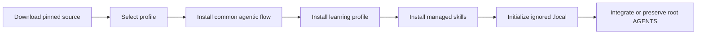
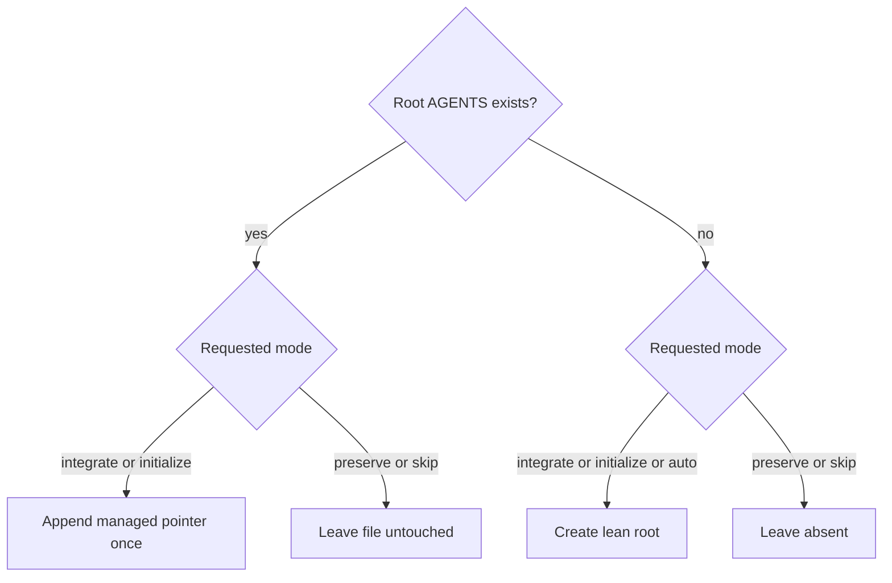

# Installer behavior

The PowerShell, POSIX shell, and batch entry points install a repository-native collaboration and learning framework without replacing repository-specific instructions.



## Installed components

1. common `agentic-flow/`;
2. common `agentic-workflow` and `learn-anything` skills unless skipped;
3. the selected minimal or full `learning-flow/` profile and its managed skills;
4. an ignored repository-root `.local/` learning workspace;
5. optional root `AGENTS.md` integration.

The local workspace contains `learning-history.md`, `sessions/`, and `follow-ups/`. Setup appends `/.local/` to `.gitignore` when no equivalent rule exists, creates missing surfaces, and never overwrites existing local history.

> [!IMPORTANT]
> `update` owns framework files listed in managed manifests. Repository-authored maps, takeaways, settings, local history, and unrelated skills remain outside destructive refresh behavior.

## Profiles

| Profile | Default | Intended use |
|---|---:|---|
| `minimal` | yes | daily work and compact learning support |
| `full` | no | deliberate onboarding and focused repository-learning skills |

Minimal can upgrade to full in update mode. Full-to-minimal update is rejected because automatic deletion could remove repository-authored content.

## Framework modes

| Mode | Behavior |
|---|---|
| `fail` | stop on existing managed framework content or skills |
| `merge` | add missing content and preserve existing files |
| `update` | refresh managed files and skills, remove retired managed files, preserve user-owned state |
| `replace` | reinstall framework directories and managed skills, preserve unrelated skills |

## Root integration

```text
--root-agents auto|integrate|initialize|preserve|skip
-RootAgents Auto|Integrate|Initialize|Preserve|Skip
```

- `auto`: ask interactively; otherwise preserve an existing root file or initialize the lean root when none exists;
- `integrate`: append the idempotent managed pointer, or create the lean root when missing;
- `initialize`: create the lean root when missing and otherwise append only the pointer;
- `preserve`: leave root instructions untouched and record integration as pending;
- `skip`: leave root instructions untouched and record explicit-only use.

`--skip-root-agents` and `-SkipRootAgents` remain compatibility aliases for `skip`.



The installer never replaces an existing root file wholesale.

<details>
<summary>Compatibility and migration notes</summary>

- `--skip-skills` or `-SkipSkills` installs the Markdown-only fallback.
- Old contributor placeholders retired by a managed manifest can be removed during update.
- Contributor-authored legacy learning state is never deleted automatically. Copy it into `.local/`, verify it, then remove the tracked source explicitly.
- Repeated local workspace initialization is idempotent.
- Team installations should pin a tag or commit rather than relying on a moving branch.

</details>
