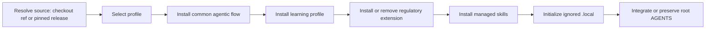
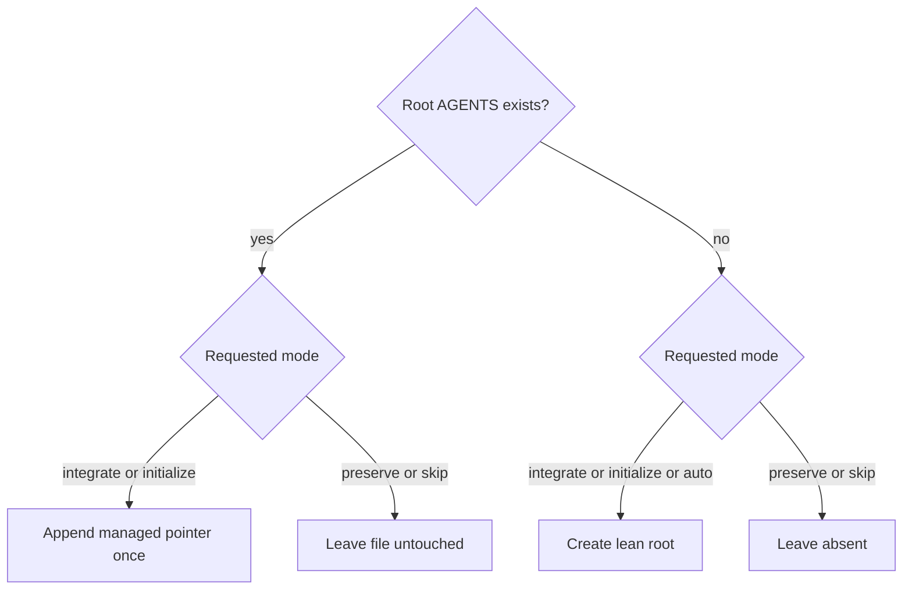

# Installer behavior

The PowerShell, POSIX shell, and batch entry points install a repository-native collaboration and learning framework without replacing repository-specific instructions.

These scripts perform **complete installation**. They are intentionally separate
from the guided adoption process under `adoption/`, which is for repositories
that already have their own agentic delivery layer.

For team and enterprise use, the preferred distribution path is a pinned,
checksum-verified packaged release (`--release`/`-Release`). Checkout-based
installers (`--ref`/`-Ref`, defaulting to `main`) remain available and are the
right choice for framework development and experimentation, but they resolve
a mutable source snapshot with no checksum, so treat them as a development
path rather than a production one.


```mermaid
flowchart LR
    D[Resolve source: checkout ref or pinned release] --> P[Select profile]
    P --> C[Install common agentic flow]
    C --> L[Install learning profile]
    L --> Ext[Install or remove regulatory extension]
    Ext --> S[Install managed skills]
    S --> X[Initialize ignored .local]
    X --> R[Integrate or preserve root AGENTS]
```

## Installing a packaged release

```text
--release TAG
-Release TAG
```

```text
sh install.sh --release v1.0.0 --profile minimal
```

```powershell
.\install.ps1 -Release v1.0.0 -Profile Minimal
```

`--release`/`-Release` downloads the packaged artifact and `checksums.txt`
published against that exact tag on the repository's
[Releases page](https://github.com/legrab/codebase-learning-flow/releases),
verifies the SHA-256 checksum before extracting anything, and cross-checks
the package's own `VERSION` file against the requested tag. `--ref`/`-Ref`
and `--release`/`-Release` are mutually exclusive. `latest` is not accepted
as a release value: look up the current tag on the Releases page (the
version above will go stale as new releases ship) and pass it explicitly.
This is deliberate, not an oversight -- see "Release-based distribution" in
`docs/DESIGN_NOTES.md`.

Every install prints which trust boundary it used:

```text
Codebase Learning Flow
Version: v1.0.0
Source: packaged release (checksum verified)
```

```text
Codebase Learning Flow
Version: 4f2ab61 (ref: main)
Source: development checkout (mutable unless ref is a commit or tag)
```

Release packages are built by `scripts/build-release.sh` from `MANIFEST.txt`
and validated end to end (`scripts/ci-release-test.sh`, on both installers)
by `.github/workflows/release.yml` before anything is published. A release
never ships something CI has not already installed and exercised.

## Installed components

1. common `agentic-flow/`;
2. common `agentic-workflow`, `learn-anything`, and `structured-change` skills unless skipped;
3. the selected minimal or full `learning-flow/` profile and its managed skills;
4. the `regulatory` extension's `learning-flow/REGULATORY.md` and `regulatory-knowledge` skill, only when `--extension regulatory` is selected;
5. an ignored repository-root `.local/` learning workspace;
6. optional root `AGENTS.md` integration.

The local workspace contains `learning-history.md`, `sessions/`, and `follow-ups/`. Setup appends `/.local/` to `.gitignore` when no equivalent rule exists, creates missing surfaces, and never overwrites existing local history.

> [!IMPORTANT]
> `update` owns framework files listed in managed manifests. Repository-authored maps, takeaways, settings, local history, and unrelated skills remain outside destructive refresh behavior.

## Profiles

| Profile | Default | Intended use |
|---|---:|---|
| `minimal` | yes | daily work and compact learning support |
| `full` | no | deliberate onboarding and focused repository-learning skills |

Minimal can upgrade to full in update mode. Full-to-minimal update is rejected because automatic deletion could remove repository-authored content.

## Extensions

| Extension | Default | Adds |
|---|---:|---|
| `none` | yes | nothing |
| `regulatory` | no | `regulatory-knowledge` skill and `learning-flow/REGULATORY.md` |

```text
--extension auto|none|regulatory
-Extension Auto|None|Regulatory
```

Extensions are orthogonal to profile: `regulatory` installs the same way under `minimal` or `full`. `auto` (the default) keeps whatever is currently installed and defaults a fresh install to `none`. Adding the extension works in any mode; removing it (`regulatory` -> `none`) requires `update` or `replace`, for the same reason a destructive profile switch does: `merge` never removes content, and `fail` only ever targets an empty installation.

## Framework modes

| Mode | Behavior |
|---|---|
| `fail` | stop on existing managed framework content or skills |
| `merge` | add missing content and preserve existing files |
| `update` | refresh managed files and skills, remove retired managed files, preserve user-owned state |
| `replace` | reinstall framework directories and managed skills, preserve unrelated skills |

## Root integration

```text
--root-agents auto|integrate|initialize|preserve|skip
-RootAgents Auto|Integrate|Initialize|Preserve|Skip
```

- `auto`: ask interactively; otherwise preserve an existing root file or initialize the lean root when none exists;
- `integrate`: append the idempotent managed pointer, or create the lean root when missing;
- `initialize`: create the lean root when missing and otherwise append only the pointer;
- `preserve`: leave root instructions untouched and record integration as pending;
- `skip`: leave root instructions untouched and record explicit-only use.

`--skip-root-agents` and `-SkipRootAgents` remain compatibility aliases for `skip`.


```mermaid
flowchart TB
    A{Root AGENTS exists?}
    A -->|yes| B{Requested mode}
    A -->|no| C{Requested mode}
    B -->|integrate or initialize| D[Append managed pointer once]
    B -->|preserve or skip| E[Leave file untouched]
    C -->|integrate or initialize or auto| F[Create lean root]
    C -->|preserve or skip| G[Leave absent]
```

The installer never replaces an existing root file wholesale.

<details>
<summary>Compatibility and migration notes</summary>

- `--skip-skills` or `-SkipSkills` installs the Markdown-only fallback.
- Old contributor placeholders retired by a managed manifest can be removed during update.
- Contributor-authored legacy learning state is never deleted automatically. Copy it into `.local/`, verify it, then remove the tracked source explicitly.
- Repeated local workspace initialization is idempotent.
- Team installations should use `--release`/`-Release` with an exact tag rather than relying on a moving branch. A `--ref`/`-Ref` commit SHA is pinned too, but skips checksum verification and the packaged-release documentation-inclusion guarantees.

</details>
