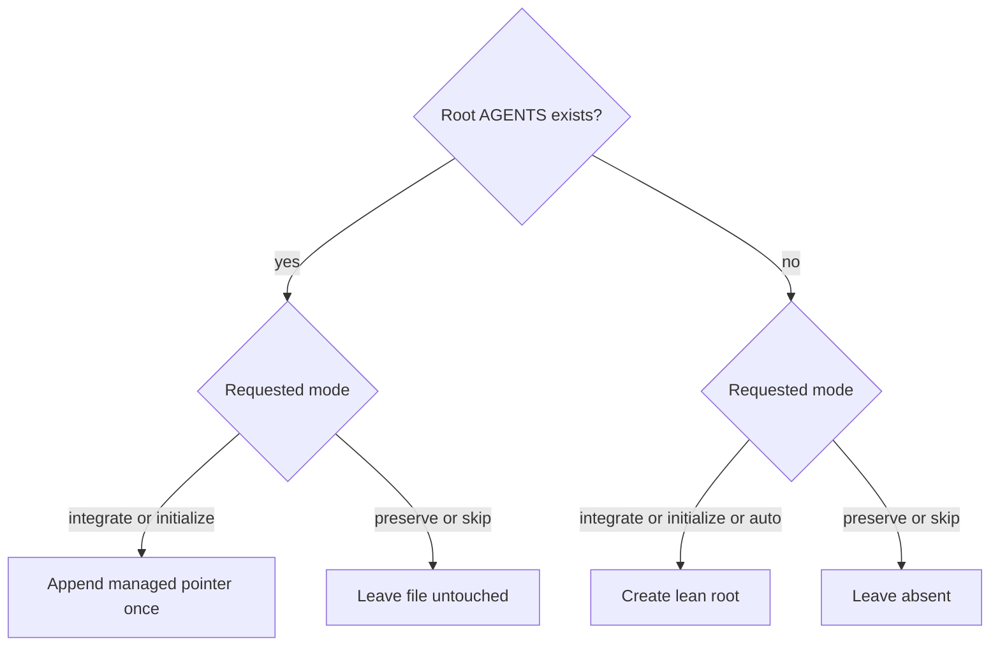

# Installer behavior

The PowerShell, POSIX shell, and batch entry points install a repository-native collaboration and learning framework without replacing repository-specific instructions.

These scripts perform **complete installation**. They are intentionally separate
from the guided adoption process under `adoption/`, which is for repositories
that already have their own agentic delivery layer.

For team and enterprise use, the preferred distribution path is a pinned,
checksum-verified packaged release (`--release`/`-Release`). Checkout-based
installers (`--ref`/`-Ref`, defaulting to `main`) remain available and are the
right choice for framework development and experimentation, but they resolve
a mutable source snapshot with no checksum, so treat them as a development
path rather than a production one.


```mermaid
flowchart LR
    D[Resolve source: checkout ref or pinned release] --> Sc[Resolve scope and root]
    Sc --> P[Select profile]
    P --> C[Install common agentic flow]
    C --> L[Install learning profile]
    L --> Ext[Install or remove regulatory extension]
    Ext --> S[Install managed skills]
    S --> X[Initialize ignored .local]
    X --> R[Integrate or preserve root AGENTS]
    R --> M[Record scope and version marker]
```

Under `--scope global` the steps that write repository state — `.local/`, `.gitignore`, root `AGENTS.md` — are skipped. Under `--scope linked` the steps that write framework content are skipped instead.

## Installing a packaged release

```text
--release TAG
-Release TAG
```

```text
sh install.sh --release v1.5.0 --profile minimal
```

```powershell
.\install.ps1 -Release v1.5.0 -Profile Minimal
```

`--release`/`-Release` downloads the packaged artifact and `checksums.txt`
published against that exact tag on the repository's
[Releases page](https://github.com/legrab/codebase-learning-flow/releases),
verifies the SHA-256 checksum before extracting anything, and cross-checks
the package's own `VERSION` file against the requested tag. `--ref`/`-Ref`
and `--release`/`-Release` are mutually exclusive. `latest` is not accepted
as a release value: look up the current tag on the Releases page (the
version above will go stale as new releases ship) and pass it explicitly.
This is deliberate, not an oversight -- see "Release-based distribution" in
`docs/DESIGN_NOTES.md`.

Every install prints which trust boundary it used:

```text
Codebase Learning Flow
Version: v1.5.0
Source: packaged release (checksum verified)
```

```text
Codebase Learning Flow
Version: 4f2ab61 (ref: main)
Source: development checkout (mutable unless ref is a commit or tag)
```

Release packages are built by `scripts/build-release.sh` from `MANIFEST.txt`
and validated end to end (`scripts/ci-release-test.sh`, on both installers)
by `.github/workflows/release.yml` before anything is published. A release
never ships something CI has not already installed and exercised.

## Installed components

Under `--scope repository`, all six; under `global`, only the framework-owned parts of 1–4; under `linked`, only the repository-authored parts of 1 and 3 plus 5 and 6.

1. common `agentic-flow/`;
2. common `agentic-workflow`, `learn-anything`, and `structured-change` skills unless skipped;
3. the selected minimal or full `learning-flow/` profile and its managed skills;
4. the `regulatory` extension's `learning-flow/REGULATORY.md` and `regulatory-knowledge` skill, only when `--extension regulatory` is selected;
5. an ignored repository-root `.local/` learning workspace;
6. optional root `AGENTS.md` integration.

The local workspace contains `learning-history.md`, `sessions/`, and `follow-ups/`. Setup appends `/.local/` to `.gitignore` when no equivalent rule exists, creates missing surfaces, and never overwrites existing local history.

> [!IMPORTANT]
> `update` owns framework files listed in managed manifests. Repository-authored maps, takeaways, settings, local history, and unrelated skills remain outside destructive refresh behavior.

## Scopes

```text
--scope repository|global|linked
-Scope Repository|Global|Linked
```

| Scope | Default root | Installs | Skips |
|---|---|---|---|
| `repository` | the current directory | everything | nothing |
| `global` | `$HOME/.agents` or `%USERPROFILE%\.agents` | managed files and managed skills | `.local/`, `.gitignore`, root `AGENTS.md` |
| `linked` | the current directory | repository-authored seeds, `.local/`, root `AGENTS.md` | managed files and managed skills |

`repository` is the default, so an existing command line keeps behaving exactly as before.

Which files belong to which scope is declared, not inferred: `.managed-files` and `.managed-skills` name framework-owned content, and `.repository-files` names the seeds a repository authors afterward (`SETTINGS.md`, `DECISIONS.md`, `MAP.md`, `TAKEAWAYS.md`, and `REPOSITORIES.md` in the full profile). `scripts/ci-validate.py` fails if a packaged file appears in neither manifest or in both.

Under `global`, managed skills install to `<root>/skills/` rather than `<root>/.agents/skills/`, because the global root is itself the `.agents` directory a host agent scans. Skills the framework does not manage are never touched.

Global storage does not by itself prove that a host reads global instructions.
Configure the host discovery bridge documented in
`agentic-flow/HOST_INTEGRATION.md`; the installer reports this required next
step but does not edit host account settings.

`--target`/`-TargetPath` overrides the global root when given. `CODEBASE_LEARNING_FLOW_HOME` overrides the default location for every scope's global lookup.

<details>
<summary>Linked-scope rules and scope conversion</summary>

- `linked` requires an existing global installation and refuses to run without one, rather than silently downloading a possibly different version into the repository.
- `linked` inherits the global installation's profile and extension. Passing a conflicting `--profile` or `--extension` is an error: the repository would be seeded for a routing contract it does not read.
- Repository-authored seeds are copied only when missing, in every mode. There is no framework content in a linked repository for `update` or `replace` to refresh, so those modes cannot destroy authored learning state.
- `repository` → `linked` requires `update` or `replace`. It removes the repository's managed files and managed skills through their own manifests and leaves authored files in place.
- `linked` → `repository` requires `merge`, `update`, or `replace`, and inherits the profile and extension the global installation was providing. A vault-linked repository must run `unregister --restore` first.
- Installing `--scope repository` while a global installation exists is allowed but warned about: the host agent would discover every managed skill twice.

</details>

## Optional LearningVault storage

LearningVault does not add another install scope. It changes only the physical
storage of repository-authored state and therefore requires `linked` scope.
The global installation remains under `~/.agents`; the vault defaults to
`$HOME/LearningVault` (`%USERPROFILE%\LearningVault` on Windows).

```text
--vault-init
--vault-register
--vault-path PATH

-VaultInit
-VaultRegister
-VaultPath PATH
```

- `vault-init` initializes the vault as a local Git repository, copies its
  README, root `AGENTS.md`, and `.gitignore` only when missing, and refreshes
  its installer-owned registration scripts;
- `vault-register` implies initialization and, after a successful linked
  install, moves `.local/`, `learning-flow/`, and `agentic-flow/` into the
  vault and links them back;
- `CODEBASE_LEARNING_VAULT` overrides the default root when no path option is
  supplied.

The combined registration path does not add `/.local/` to shared `.gitignore`.
Instead, registration owns one marked block in the source Git repository's
`.git/info/exclude` for the three linked directories. Existing unrelated
exclude entries are preserved, and root `AGENTS.md` is not excluded.

```powershell
& "$HOME\LearningVault\scripts\register-vault.ps1" status
& "$HOME\LearningVault\scripts\register-vault.ps1" relink -RepositoryId <id>
& "$HOME\LearningVault\scripts\register-vault.ps1" unregister -Restore
```

```sh
"$HOME/LearningVault/scripts/register-vault.sh" status
"$HOME/LearningVault/scripts/register-vault.sh" relink --repository-id <id>
"$HOME/LearningVault/scripts/register-vault.sh" unregister --restore
```

Registration is transactional across the three state directories: it
preflights link support, refuses source/vault conflicts, and restores moved
directories when link creation fails. Rerunning against the same targets is
idempotent. `relink` repairs absolute junction/symlink targets after the vault
or source is moved. `unregister` requires explicit restoration so it cannot
silently leave a repository without its state.

Tracked `agentic-flow`, `learning-flow`, or `.local` content is refused rather
than automatically removed from the source repository's index. Resolve that
team-visible migration deliberately first. Each Git worktree is a separate
registration because links live in the worktree filesystem; nested invocations
must target the repository top level.

The vault never creates/configures a remote, stages files, or commits.
Repository IDs combine a sanitized repository name with a hash of the origin
URL (when one exists) and absolute worktree path. This keeps clones and
worktrees separate. Use the recorded or explicit ID when relinking after a
source or vault relocation.

## Version and scope marker

Each root records `learning-flow/.install-scope`:

```text
scope: linked
version: v1.5.0
global-version: v1.5.0
```

The installer is the reader. On a `linked` install it compares the version being written against the global installation's own and warns when they differ; `scripts/ci-install-test.sh` and `scripts/ci-release-test.sh` assert the two agree after a paired install. Installations predating this marker are treated as `repository`.

## Profiles

| Profile | Default | Intended use |
|---|---:|---|
| `minimal` | yes | daily work and compact learning support |
| `full` | no | deliberate onboarding and focused repository-learning skills |

Minimal can upgrade to full in update mode. Full-to-minimal update is rejected because automatic deletion could remove repository-authored content.

## Extensions

| Extension | Default | Adds |
|---|---:|---|
| `none` | yes | nothing |
| `regulatory` | no | `regulatory-knowledge` skill and `learning-flow/REGULATORY.md` |

```text
--extension auto|none|regulatory
-Extension Auto|None|Regulatory
```

Extensions are orthogonal to profile: `regulatory` installs the same way under `minimal` or `full`. `auto` (the default) keeps whatever is currently installed and defaults a fresh install to `none`. Adding the extension works in any mode; removing it (`regulatory` -> `none`) requires `update` or `replace`, for the same reason a destructive profile switch does: `merge` never removes content, and `fail` only ever targets an empty installation.

## Framework modes

| Mode | Behavior |
|---|---|
| `fail` | stop on existing managed framework content or skills |
| `merge` | add missing content and preserve existing files |
| `update` | refresh managed files and skills, remove retired managed files, preserve user-owned state |
| `replace` | reinstall framework directories and managed skills, preserve unrelated skills |

## Root integration

```text
--root-agents auto|integrate|initialize|preserve|skip
-RootAgents Auto|Integrate|Initialize|Preserve|Skip
```

- `auto`: ask interactively; otherwise preserve an existing root file or initialize the lean root when none exists;
- `integrate`: append the idempotent managed pointer, or create the lean root when missing;
- `initialize`: create the lean root when missing and otherwise append only the pointer;
- `preserve`: leave root instructions untouched and record integration as pending;
- `skip`: leave root instructions untouched and record explicit-only use.

`--skip-root-agents` and `-SkipRootAgents` remain compatibility aliases for `skip`.


```mermaid
flowchart TB
    A{Root AGENTS exists?}
    A -->|yes| B{Requested mode}
    A -->|no| C{Requested mode}
    B -->|integrate or initialize| D[Append managed pointer once]
    B -->|preserve or skip| E[Leave file untouched]
    C -->|integrate or initialize or auto| F[Create lean root]
    C -->|preserve or skip| G[Leave absent]
```

The installer never replaces an existing root file wholesale.

<details>
<summary>Compatibility and migration notes</summary>

- `--skip-skills` or `-SkipSkills` installs the Markdown-only fallback.
- Old contributor placeholders retired by a managed manifest can be removed during update.
- Contributor-authored legacy learning state is never deleted automatically. Copy it into `.local/`, verify it, then remove the tracked source explicitly.
- Repeated local workspace initialization is idempotent.
- Team installations should use `--release`/`-Release` with an exact tag rather than relying on a moving branch. A `--ref`/`-Ref` commit SHA is pinned too, but skips checksum verification and the packaged-release documentation-inclusion guarantees.

</details>
