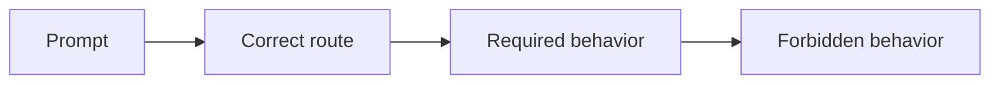

# Routing and behavior checks

These fixtures are lightweight regression cases, not a benchmark or scoring system.

- `agentic-cases.yaml` checks workflow configuration, root integration, layer separation, local closure, promotion, defaults, approvals, and evidence language.
- `conversation-cases.yaml` checks general-topic learning, adaptive conversation, trial and error, human educational value, AI independence, and routing back to repository learning.
- `minimal-cases.yaml` checks the compact repository skill, resilience and ownership lenses, and persistence restraint.
- `full-cases.yaml` checks focused skill routing, responsible machine-generated work review, domain depth, and anti-ceremony behavior.

Review these fixtures when changing skill descriptions, routing, profiles, educational principles, baseline research, local continuity, understanding checks, or persistence rules.

> [!NOTE]
> Expected phrases describe behavioral evidence, not exact generated wording.
