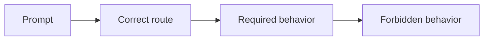

# Routing and behavior checks

These fixtures are lightweight regression cases, not a benchmark or scoring system.

```mermaid
flowchart LR
    P[Prompt] --> R[Correct route]
    R --> B[Required behavior]
    B --> N[Forbidden behavior]
```

- `agentic-cases.yaml` checks workflow configuration, root integration, layer separation, local closure, promotion, defaults, approvals, and evidence language.
- `conversation-cases.yaml` checks general-topic learning, adaptive conversation, trial and error, human educational value, AI independence, and routing back to repository learning.
- `minimal-cases.yaml` checks the compact repository skill, resilience and ownership lenses, and persistence restraint.
- `full-cases.yaml` checks focused skill routing, responsible machine-generated work review, domain depth, and anti-ceremony behavior.
- `structured-change-cases.yaml` checks when Explore/Design/Approve is (and is not) warranted, decision-record promotion discipline, traceability proportionality, and the regulatory extension's additive, non-reproducing behavior.

Review these fixtures when changing skill descriptions, routing, profiles, extensions, educational principles, baseline research, local continuity, understanding checks, or persistence rules.

> [!NOTE]
> Expected phrases describe behavioral evidence, not exact generated wording.

## Additional lifecycle and adoption cases

`learning-lifecycle-cases.yaml` covers learning placement and freshness checks.
`adoption-cases.yaml` covers guided integration into repositories with an
existing agentic setup. Both are intended to protect against unnecessary
context expansion and framework ceremony.
